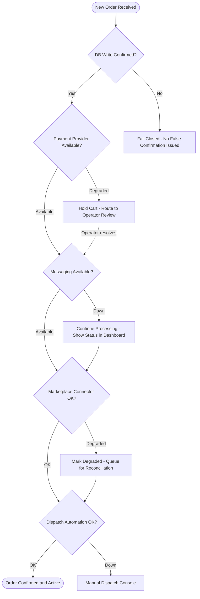
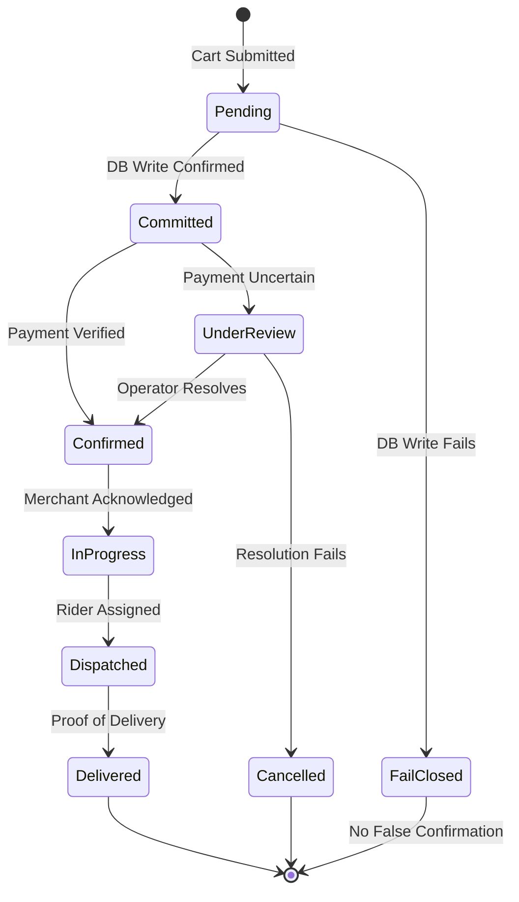
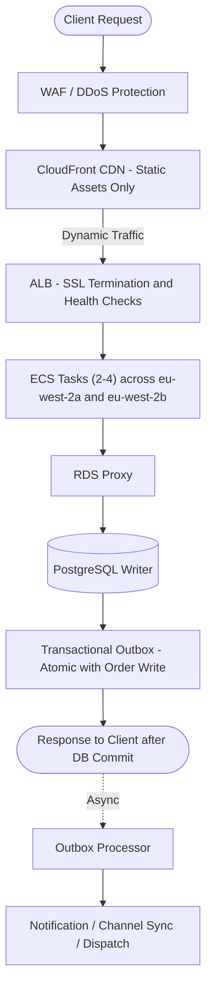
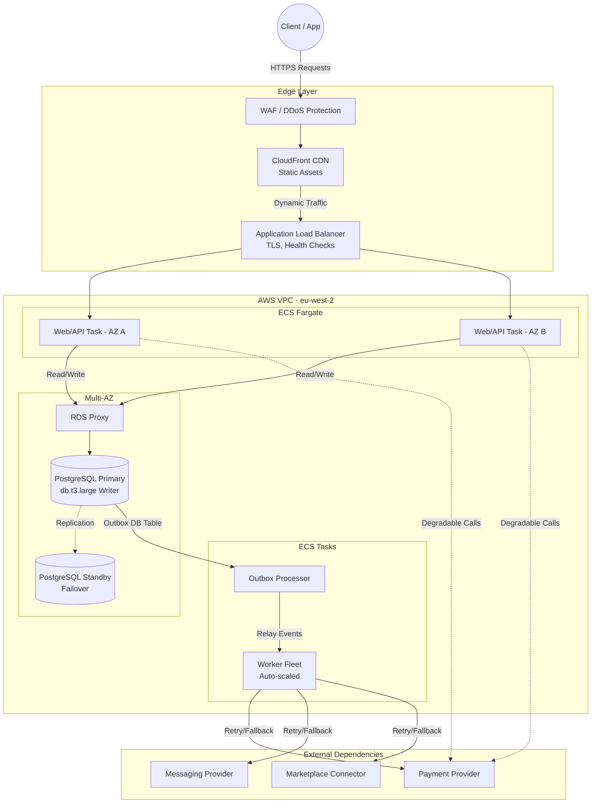

# High Level Overview of UK Food Delivery System (Pilot MVP)

The correct promise is not literal zero downtime across every dependency at every moment, because parts of the order flow depend on third-party payment, messaging, mapping, and marketplace providers that the platform does not fully control. The right MVP position is highest practical availability for platform-controlled services, plus safe degradation and clear status when external dependencies fail.

The MVP reliability promise is:

- for platform-controlled services, the system is designed for the highest practical availability the MVP budget and architecture can realistically support
- scheduled maintenance can be limited to low-traffic windows, but incidents must degrade safely rather than cause silent order loss
- no acknowledged order loss
- no single app server failure or single Availability Zone failure should hide committed orders
- if an external dependency degrades, the platform must either confirm the order through a fallback path or stop making false success claims
- merchants and operators must always see whether an order is confirmed, pending, delayed, or at risk

## **Core Business Requirements**

The underlying business requirement is simple:

1. customers must not lose confidence after one failed order
2. merchants must not miss paid or confirmed orders
3. the platform must not silently fail
4. if one provider is down, the order flow should degrade safely rather than break invisibly

The MVP is therefore best positioned as a trust-first platform, not just a feature-first platform.

## **MVP Reliability Promise**

For the first production version, the service commitment should be:

- core order capture and merchant visibility designed for the highest practical availability the MVP can credibly support, with a target of 99.9 percent monthly availability across platform-controlled services
- scheduled maintenance can happen in low-order windows with rollback-ready deployment practices
- accepted orders are only acknowledged after durable database commit
- active orders remain visible to merchants even if notification, mapping, or channel sync is delayed
- retries, replay, and reconciliation are built in from day one
- manual and automated fallback paths exist for confirmation, dispatch, and incident handling
- degraded mode is explicit in the product, not hidden from operators

## **How We Tackle Incidents, Outages, and Provider Failures**

This is the core reliability position.

The platform is designed to remain resilient to unexpected failures in five ways:

1. it only confirms an order after durable write, so a crash cannot erase an already-acknowledged order
2. it isolates dependency failures so payment, messaging, mapping, and channel issues do not all become order-loss events
3. it shifts failed side effects into retry, replay, reconciliation, or operator review instead of silently dropping them
4. it shows merchants and operators the real state of each order, including pending, degraded, delayed, and at-risk conditions
5. it provides manual fallback for dispatch, support, and exception resolution when automation is degraded

The reliability commitment is straightforward: routine maintenance can be scheduled, but unexpected failures must be detected quickly, contained, surfaced clearly, and recovered without false success claims.

## **What We Do Not Promise**

- 100 percent uptime across all systems
- 99.99 percent availability from day one
- multi-region active-active at MVP
- instant recovery from every payment or messaging outage
- perfect real-time sync across every channel connector

Those claims sound strong, but they weaken credibility if challenged.

## **Proposed MVP System Design**

### **Core architecture**

The MVP should use:

- a modular monolith or two coarse deployables: web or API plus background workers
- PostgreSQL as the canonical source of truth for orders and state transitions
- transactional outbox so order commit and downstream event emission stay consistent
- managed high-availability cloud infrastructure in one production region
- at least two application instances across multiple Availability Zones
- structured logging, metrics, traces, alerting, and synthetic checks from day one

### **Why not start with microservices**

The platform can reasonably evolve into microservices later, especially if it expands into areas such as restaurant marketing automation.

However, the option to extract services later does not justify distributing the core order flow at MVP stage.

For day one, the safer approach is a modular monolith because:

- order creation, payment confirmation, and order-state changes need strong consistency
- early distributed services add network failures, timeout chains, data ownership complexity, and harder incident recovery
- the highest-risk business path is the order-write path, so it should have the fewest moving parts possible
- a small team can ship and stabilize a modular monolith faster than a service estate with separate deployments and cross-service observability requirements

The appropriate approach is to design for future service extraction, but not to distribute the trust-critical path before the product has earned that complexity.

## **How the architecture evolves later**

The MVP should be structured so microservice extraction is possible without a rewrite.

That means:

- separate internal modules from day one for ordering, merchant operations, dispatch, channel adapters, notifications, and future marketing workflows
- use a transactional outbox so domain events already exist in a safe and replayable form
- define clean internal APIs and ownership boundaries even while the code stays in one deployable
- extract services only when there is a real trigger such as independent scaling need, faster release cadence, or materially different reliability requirements

**Likely early extraction candidates are:**

1. marketing automation
2. notification delivery
3. channel adapter processing
4. dispatch optimization

The canonical order state machine should remain the most protected part of the platform until volume, team structure, and operational maturity justify splitting it further.

## **Fallback Strategy That Protects Trust**

The key design requirement is not only uptime. It is safe degradation.

### **If payment provider is degraded**

- do not mark prepaid orders as confirmed without provider-confirmed server-side status
- preserve the cart where possible
- allow unpaid or cash flow only where the merchant explicitly supports it
- route uncertain payments into operator review rather than silent failure

### **If messaging provider is degraded**

- continue processing orders normally
- do not depend on message delivery as the source of truth
- show confirmed order state in the customer web view and merchant dashboard
- use SMS or an alternate message path only if separately integrated and tested

### **If marketplace connector is delayed or down**

- persist raw inbound and outbound payloads
- mark the connector as degraded
- stop pretending sync is current
- show merchants which orders are confirmed and which are pending external sync
- reconcile after recovery

### **If rider or dispatch automation fails**

- switch to manual dispatch console
- keep merchant-facing order state visible
- continue proof-of-pickup and proof-of-delivery capture through backup operator workflow if needed

### **If database writes cannot be confirmed**

- fail closed for new order acceptance
- do not acknowledge the order and try to fix it later
- preserve trust by refusing false confirmation

This last point is critical. A system that stays open while losing confirmed orders is worse than a system that temporarily stops new intake.

### **Degradation Decision Flow**

## **Error Detection Strategy For MVP**

The MVP should detect and act on failures in five layers.

```mermaid
flowchart LR
    subgraph L1[Layer 1 - Ingress]
        I1[Signature Check]
        I2[Payload Validation]
        I3[Deduplication]
    end
    subgraph L2[Layer 2 - Canonical Processing]
        C1[State Machine Validation]
        C2[Payment State Check]
        C3[Stuck Order Detection]
    end
    subgraph L3[Layer 3 - Outbound Delivery]
        O1[Timeout and 5xx Detection]
        O2[Retry with Backoff and Jitter]
        O3[Dead-letter on Exhaustion]
    end
    subgraph L4[Layer 4 - Reconciliation]
        R1[Missed Webhook Recovery]
        R2[State Mismatch Resolution]
        R3[Settlement Audit Trail]
    end
    subgraph L5[Layer 5 - Observability]
        V1[Backlog Age Alerts]
        V2[DLQ Growth Monitoring]
        V3[On-call Escalation]
    end

    L1 --> L2 --> L3 --> L4 --> L5
```

### **1. Ingress detection**

Detect:

- bad signatures or unauthorized webhook calls
- malformed payloads
- duplicate deliveries
- out-of-order events
- provider no-data conditions when traffic is expected

Action:

- persist raw payloads where possible
- deduplicate safely
- queue issues for retry or operator review
- alert if durable acceptance starts failing or expected events disappear

### **2. Canonical processing detection**

Detect:

- invalid order state transitions
- handler crashes after raw-event persistence
- stuck orders in non-terminal state
- payment-state mismatch blocking the next step
- missing merchant acknowledgement

Action:

- reject illegal transitions
- retry safe failures automatically
- create operator-visible issues for blocked orders
- show merchant warnings only when merchant action can reduce harm

### **3. Outbound delivery detection**

Detect:

- timeouts and 5xx responses from external providers
- rate limits
- stale command conflicts
- retry exhaustion

Action:

- retry with backoff and jitter
- slow the affected connector lane
- dead-letter on exhaustion
- escalate only when the issue creates meaningful risk or delay for live orders

### **4. Reconciliation detection**

Detect:

- missed webhooks
- canonical state that disagrees with external state
- settlement or refund mismatches
- missing audit evidence for manual overrides

Action:

- backfill from provider APIs or reports
- reopen at-risk orders for operator review
- preserve full evidence trail for support and finance

### **5. Observability detection**

Detect:

- growing backlog age
- dead-letter queue growth
- telemetry blind spots
- failure of the operator exception queue

Action:

- page on-call only for incident-grade conditions
- keep business-hours triage for isolated contained issues
- make backlog age a first-class alert, not just queue depth

## **Order Confirmation Model**

This is the simplest way to present the trust model.

| **System Condition**                                  | **What Customer Sees**                              | **What Merchant Sees**                       | **Platform Behavior**                                   |
| ----------------------------------------------------- | --------------------------------------------------- | -------------------------------------------- | ------------------------------------------------------- |
| order committed successfully                          | confirmed order                                     | confirmed active order                       | normal flow                                             |
| order accepted internally but external update pending | confirmed or pending-sync status, depending on path | visible order with pending sync marker       | retry and reconcile                                     |
| payment uncertain                                     | payment pending or order under review               | hold state, not prepare-yet warning          | operator review and provider re-check                   |
| messaging delayed                                     | order still visible in web status view              | normal active order view                     | continue processing without treating messaging as truth |
| connector degraded                                    | source flagged as delayed                           | degraded connector banner plus source labels | pause unsafe assumptions and recover later              |
| database cannot commit                                | no false confirmation                               | no false order shown                         | fail closed for new acceptance                          |

### **Order Lifecycle State Machine**

## **System Design for MVP Pilot**

This spec is appropriate for the 8-12 week pilot.

This section provides concrete capacity figures and infrastructure configuration for the 8–12 week pilot phase: 3–5 live merchants, one micro-zone, focused on reliable execution over maximum scale.

The architecture is designed to handle 500+ concurrent requests (burst headroom), but realistic pilot peak is 150–200 simultaneous requests during meal-time windows.

### **Capacity Targets**

**500 concurrent requests = pilot ceiling, not baseline.** The architecture is designed to handle it, but the pilot (3–5 merchants, one micro-zone) is not expected to reach this load. Realistic peak is 150–200 simultaneous requests during meal-time bursts.

| **Metric**                     | **Pilot Value** | **Rationale**                                                                          |
| ------------------------------ | --------------- | -------------------------------------------------------------------------------------- |
| Baseline simultaneous requests | 50–100          | 3–5 merchants during non-peak hours; browse dominates                                  |
| Peak simultaneous requests     | 150–200         | Lunch/dinner bursts; still within pilot capacity                                       |
| Sustained RPS (peak)           | 100–200         | Order create, menu fetch, status checks combined                                       |
| Orders per minute (peak)       | 10–30           | Realistic for 3–5 merchants in a dense micro-zone                                      |
| API response time target       | p95 < 500ms     | Global target for the dynamic API tier, excluding external payment provider round-trip |
| Session duration               | 5–15 minutes    | Customer browse to checkout                                                            |
| 500 concurrent requests        | Pilot ceiling   | Design target for scale headroom; Phase 1 pilot unlikely to reach this baseline        |

### **Infrastructure Baseline**

#### **Application Layer**

| **Component**        | **Specification**                      | **Justification**                                         |
| -------------------- | -------------------------------------- | --------------------------------------------------------- |
| Instance type        | ECS Fargate 1 vCPU / 2GB               | Right-sized for 3–5 merchant pilot; upgradable at Phase 2 |
| Instance count       | 2 tasks minimum, 2–4 in normal ops     | One task per AZ; leaves headroom for burst                |
| Distribution         | 2 AZs (eu-west-2a, eu-west-2b)         | Failover without overcomplicating operations              |
| Auto-scaling trigger | CPU > 70% OR ALB response time > 400ms | Conservative trigger to avoid premature scale-out         |
| Max instances        | 6 total tasks                          | Sufficient burst ceiling for pilot peaks                  |

#### **Database Layer**

| **Component**          | **Specification**                          | **Justification**                                              |
| ---------------------- | ------------------------------------------ | -------------------------------------------------------------- |
| PostgreSQL writer      | db.t3.large (2 vCPU / 8GB)                 | Appropriate for pilot write volume; 10–30 orders/min peak      |
| Read offload           | Optional single read replica (Phase 2)     | Not required on day one unless reporting reads prove expensive |
| Multi-AZ               | Primary + standby (eu-west-2a, eu-west-2b) | Automatic failover for the canonical store                     |
| Connection pooling     | RDS Proxy                                  | Adequate for pilot load                                        |
| Connection pool target | 40–60 active connections on the writer     | Headroom for failover and maintenance                          |
| Write capacity         | 400–800 transactions/second on the writer  | Well above expected pilot demand (10–30 orders/min)            |

#### **Background Processing**

| **Component**    | **Specification**                               | **Justification**                                                      |
| ---------------- | ----------------------------------------------- | ---------------------------------------------------------------------- |
| Outbox processor | 1 ECS task                                      | Relay events from outbox table; pilot volume needs only one            |
| Worker fleet     | 1–2 ECS tasks (queue-depth auto-scaling)        | Notifications, channel sync, dispatch                                  |
| Queue mechanism  | Database-backed outbox for canonical write path | Appropriate at MVP because write volume is far lower than read traffic |
| DLQ monitoring   | Alert on failed outbox entries > 5              | Catch poison messages early at pilot scale                             |

#### **Network and Edge Configuration**

| **Component**             | **Specification**                                           |
| ------------------------- | ----------------------------------------------------------- |
| Application Load Balancer | ALB with path-based routing, TLS termination, health checks |
| CDN                       | CloudFront for static assets (menus, images)                |
| Rate limiting             | DB-backed at pilot; Redis-backed if Redis deployed          |
| DDoS                      | Provider-level protection (Cloudflare/AWS Shield)           |

#### **Request Flow at Pilot Scale**

### **Scaling Configuration**

#### **Auto-Scaling Parameters**

| **Service** | **Scale-Up Trigger**                         | **Scale-Down Trigger**      | **Min** | **Max** |
| ----------- | -------------------------------------------- | --------------------------- | ------- | ------- |
| Web/API     | CPU > 70% OR response time > 400ms for 2 min | CPU < 40% for 5 min         | 2       | 6       |
| Worker      | Queue depth > 50 messages for 2 min          | Queue depth < 10 for 10 min | 1       | 4       |

#### **Database Scaling Ladder**

| **Phase**    | **Writer / Reader Profile**                    | **Approx. Active DB Connections** |
| ------------ | ---------------------------------------------- | --------------------------------- |
| Pilot        | db.t3.large writer                             | 40–60                             |
| Growth       | db.r6g.xlarge writer + optional 1 read replica | 80–120                            |
| Pre-sharding | db.r6g.2xlarge writer + multiple read replicas | 120–250                           |

#### **Performance Targets at Pilot Scale**

| **Metric**                 | **Target**  | **Measurement**                                                           |
| -------------------------- | ----------- | ------------------------------------------------------------------------- |
| Order create p95 latency   | < 800ms     | End-to-end including DB commit                                            |
| Order create p99 latency   | < 1.5s      | Excluding external payment round-trip                                     |
| Read API p95 latency       | < 300ms     | Merchant dashboard, order status, hot menu lookups                        |
| Database write latency p95 | < 100ms     | Measured at RDS Proxy                                                     |
| DB connections used        | < 50        | Reserve spare connection capacity for failover, restarts, and maintenance |
| Queue backlog age          | < 5 minutes | For critical order events                                                 |

#### **Reliability at This Scale**

| **Failure Mode**         | **Protection**                  | **Recovery**                                                                                                                           |
| ------------------------ | ------------------------------- | -------------------------------------------------------------------------------------------------------------------------------------- |
| Single AZ failure        | Minimum 1 task in each of 2 AZs | Automatic; traffic continues through the surviving AZ, but with less spare room for traffic spikes until replacement tasks are healthy |
| Instance crash           | ECS health check replaces task  | < 2 minutes                                                                                                                            |
| Database primary failure | Multi-AZ failover               | ~60–90 seconds                                                                                                                         |
| Worker backlog           | Auto-scale workers, DLQ alerts  | Replay failed messages after recovery                                                                                                  |

#### **Memory and Compute Profile**

| **Component**    | **CPU**   | **Memory** | **Notes**                                     |
| ---------------- | --------- | ---------- | --------------------------------------------- |
| Web/API task     | 1 vCPU    | 2 GB       | Request handling, session management          |
| Worker task      | 0.5 vCPU  | 1 GB       | Async processing, lower CPU pressure          |
| Outbox processor | 0.25 vCPU | 0.5 GB     | Lightweight relay, DB polling                 |
| RDS Proxy        | Built-in  | Managed    | Included with RDS; no separate compute needed |

#### **Monitoring Gates for Pilot Load**

| **Metric**          | **Warning** | **Critical** |
| ------------------- | ----------- | ------------ |
| API error rate      | > 1%        | > 5%         |
| Order create p95    | > 600ms     | > 1s         |
| DB connections used | > 40        | > 60         |
| Queue backlog age   | > 3 min     | > 10 min     |
| CPU utilisation     | > 70%       | > 85%        |

---

## **Full Platform Architecture**

The diagram below shows the complete infrastructure layout for the pilot, covering the edge layer, compute tier, data layer, background processing, and external provider integrations with their safe degradation paths.

