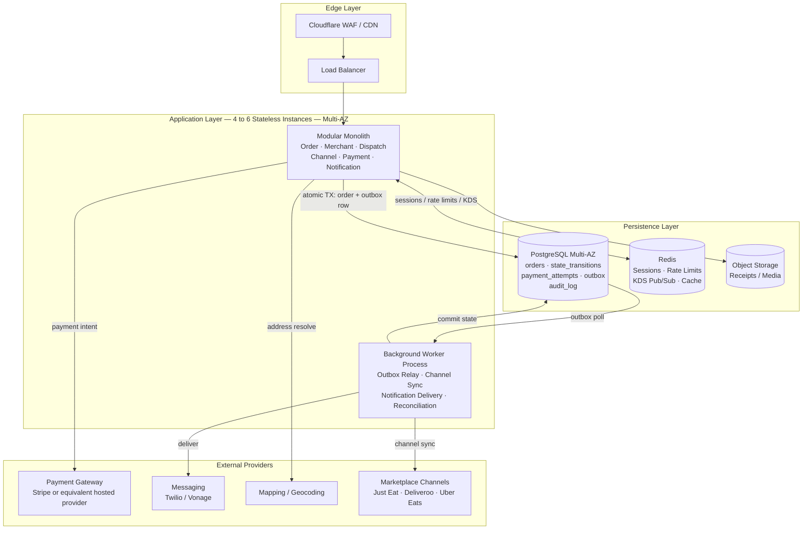
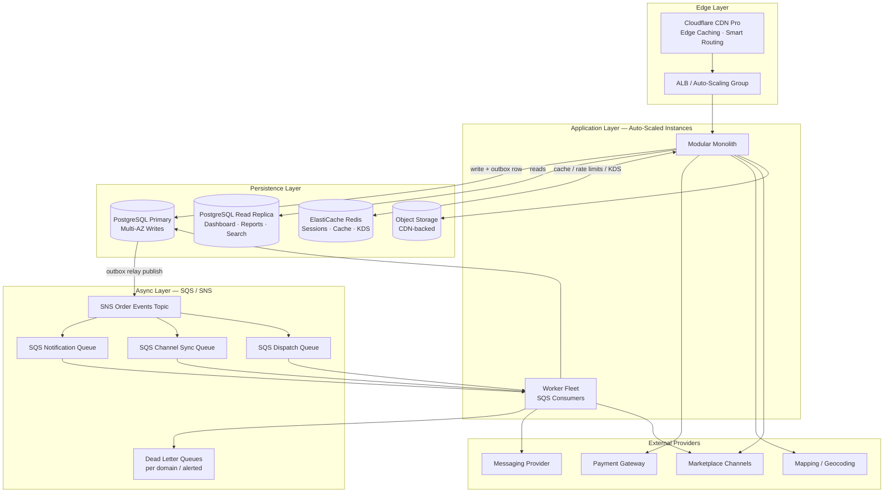
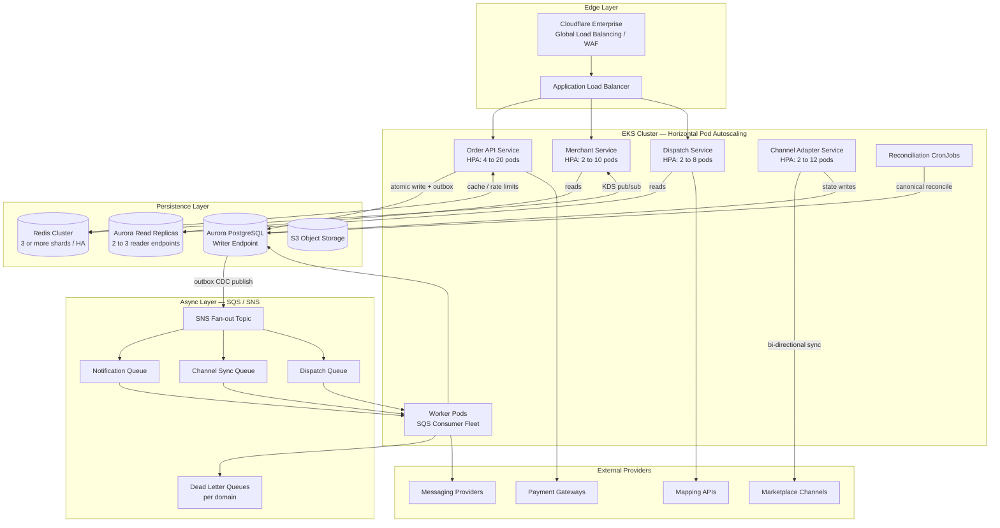
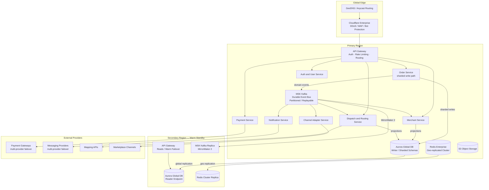

# 07. System Architecture and Reliability

## Purpose

Use this file to define the technical architecture, availability posture, and failure-handling model for FastBite in a way that an early team can build and operate.

## One-Page Summary

- For MVP, optimize for reliable order capture and merchant visibility rather than a fully decomposed microservice estate.
- Scheduled low-traffic maintenance windows are acceptable in MVP; the real promise is that incidents and dependency failures degrade safely without false confirmations or hidden committed orders.
- The canonical order record and its state transitions should be the operational source of truth.
- The durable source of truth should be the primary relational database, not the queue, cache, or notification layer.
- Events, caches, notifications, dispatch views, and channel sync are downstream projections and must reconcile from the canonical order record.

## Availability Interpretation

Literal zero downtime across every dependency is not the right promise, because parts of the order flow depend on messaging, payment, mapping, and marketplace providers that FastBite does not fully control.

The MVP reliability promise is:

highest practical availability for platform-controlled services, scheduled maintenance only in low-traffic windows, no acknowledged order loss, and no single app instance or single Availability Zone failure that hides committed orders from merchants.

Here, "no acknowledged order loss" means FastBite does not tell a customer or merchant that an order was accepted unless that order can still be found and recovered from the canonical system of record.

Availability should be defined separately for:

- core data plane: accepting orders, changing order state, and showing active orders to merchants
- supporting paths: notifications, channel synchronization, reporting, admin tools, and configuration changes

The core data plane should have the strongest guarantees. Supporting paths can degrade temporarily as long as accepted orders remain durable and visible.

## Maintenance Windows Versus Incident Resilience

Planned maintenance and unplanned failure should be discussed differently with the client and inside the build plan.

- planned maintenance can be scheduled in low-order windows if rollback is ready and order durability is not put at risk
- incidents, crashes, and provider outages are the real trust test and must be handled through containment, degraded mode, operator visibility, and recovery tooling
- the platform should prefer pausing unsafe actions over showing false success
- the platform should continue merchant visibility and safe manual operations wherever the canonical write path is still healthy

For example, if a dependency outage leaves payment or channel confirmation uncertain, the platform should keep existing committed orders visible, mark new uncertain cases as pending review or retry, and stop issuing fresh confirmations until durable capture is proven again.

## Incident Handling Priorities

When unexpected degradation happens, the order of operations should be:

1. protect the canonical write path and stop false confirmations
2. isolate the failing dependency or automation lane
3. keep merchants and operators working from FastBite-owned state where possible
4. retry, replay, or reconcile downstream effects after the immediate risk is contained
5. page humans only when live order flow or the trust boundary is materially threatened

## Suggested Availability Targets

| Capability                                                          | MVP Target                             | Later Target                            | Notes                                                                                                    |
| ------------------------------------------------------------------- | -------------------------------------- | --------------------------------------- | -------------------------------------------------------------------------------------------------------- |
| order acceptance and durable persistence on FastBite-owned channels | 99.9 percent monthly                   | 99.95 percent monthly                   | Measure as successful requests that return only after the order and outbox record are committed          |
| merchant dashboard and KDS active-order visibility                  | 99.9 percent monthly                   | 99.95 percent monthly                   | Measure freshness as well as uptime; active orders should remain visible during most dependency failures |
| dispatch workflow and rider assignment support                      | 99.5 percent monthly                   | 99.9 percent monthly                    | Manual dispatch is acceptable in MVP when automation degrades                                            |
| notifications and channel synchronization                           | best effort with durability and replay | 99.9 percent internal processing target | Do not publish a customer-facing uptime promise in MVP; guarantee retry and reconciliation instead       |
| admin, reporting, and configuration changes                         | best effort                            | 99.5 percent monthly                    | Lower priority than the live order path                                                                  |

Do not claim 99.99 percent availability for the core product until FastBite has measured SLOs for multiple quarters, tested failover, and on-call coverage that can support that target.

## Recovery Targets

- committed accepted orders: no acknowledged order loss tolerated inside the primary transaction boundary
- single app instance or worker failure: automatic recovery within minutes
- database node or single-AZ failure: target recovery within 10 minutes using managed high-availability database failover
- dependency outage backlog drain: recover queued notifications and channel sync within 15 to 30 minutes at expected peak load
- full-region disaster: not a day-one promise; define a warm recovery path before committing to hot multi-region failover
- releases: rolling or canary deployment with backward-compatible schema changes and fast rollback; blue-green is optional, not required on day one

## Recommended MVP Architecture

```text
[Cloudflare / WAF / CDN]
  -> [Load Balancer]
  -> [FastBite Application]
       | Checkout and Sessions
       | Merchant Dashboard and KDS Web
       | Order State Machine
       | Dispatch Console and Rules
       | Admin and Merchant Config
  -> [Managed PostgreSQL HA]
       | orders
       | order_state_transitions
       | payment_attempts
       | outbox
       | audit_log
  -> [Background Worker Process]
       | notifications
       | channel sync
       | reconciliation jobs
       | dispatch jobs
  -> [Queue or DB-backed Job Runner]
  -> [Redis Optional for cache, rate limiting, and ephemeral sessions]
  -> [Object Storage]
  -> [Observability + Alerting + Audit]
```

This should start as a modular monolith or, at most, two coarse deployables using the same codebase and database:

- web and API process for synchronous user-facing flows
- worker process for asynchronous integrations and notifications

For project start, treat that Phase 1 shape as the active build target. The later phases in this document are reference triggers for when measured load or operational pain justifies more infrastructure; they are not part of the MVP baseline.

Separate services should be introduced only when one of the following becomes true:

- a subsystem must scale independently from the rest of the product
- deployment coupling is causing repeated incidents or slow delivery
- team ownership boundaries are stable enough to support service boundaries
- a provider integration domain creates materially different reliability or security requirements

## Scale-Out Path After MVP

If FastBite reaches sustained order volume, integration complexity, or team growth that justifies decomposition, the likely next splits are:

- channel adapter processing into its own worker or service boundary
- dispatch optimization into its own service if routing or rider logic becomes compute-heavy
- notification delivery into a dedicated pipeline only after volume and provider diversity warrant it

Customer session management, merchant dashboard reads, and admin flows do not need independent services on day one.

## Architecture Evolution Phases

FastBite's architecture evolves in four phases, each triggered by measurable load and complexity thresholds. For current planning, only Phase 1 should shape MVP scope. Every later phase is a conditional reference path that should be activated only when trigger conditions are met; premature service decomposition adds operational burden without improving reliability at lower scales.

### Phase 1: MVP Architecture (up to 1k Simultaneous In-Flight Requests)

**Design philosophy.** A modular monolith with a single PostgreSQL writer provides the required consistency guarantees at launch without committing the platform to a later-phase scale footprint. The MVP should target roughly 500 simultaneous in-flight origin requests, with burst headroom to 1,000. PostgreSQL remains the sole durable source of truth. Redis and the job queue are disposable projections that can be rebuilt from the database.

**Stack summary:**

| Component             | Specification                             | Justification                                               |
| --------------------- | ----------------------------------------- | ----------------------------------------------------------- |
| Application instances | 4–6 ECS Fargate tasks (2 vCPU / 4GB each) | Supports MVP request concurrency with headroom across 2 AZs |
| PostgreSQL            | db.r6g.xlarge writer, Multi-AZ            | Protects the canonical write path without over-sizing       |
| Connection pooling    | PgBouncer, pool size 100–150              | Reduces connection pressure and prevents scale-out storms   |
| Redis                 | ElastiCache r6g.large, single-node        | Sessions, rate limits, hot menu/status reads                |
| Worker fleet          | 2–4 ECS tasks, auto-scaled on queue depth | Notifications, channel sync, dispatch                       |
| Outbox processor      | 1–2 ECS tasks                             | Relay events without unnecessary overprovisioning           |

**Auto-scaling parameters:**

| Service | Scale-Up Trigger                            | Scale-Down Trigger          | Min | Max |
| ------- | ------------------------------------------- | --------------------------- | --- | --- |
| Web/API | CPU > 60% OR ALB response > 300ms for 2 min | CPU < 30% for 5 min         | 4   | 12  |
| Worker  | Queue depth > 100 for 2 min                 | Queue depth < 20 for 10 min | 2   | 8   |

**Performance envelopes at MVP request concurrency:**

| Metric                     | Target    | Notes                                                          |
| -------------------------- | --------- | -------------------------------------------------------------- |
| Origin requests per second | 900–1,800 | Derived from 500–1,000 in-flight requests at sub-500ms latency |
| Order create p95           | < 800ms   | Including DB commit                                            |
| Read API p95               | < 300ms   | Dashboard, status queries                                      |
| DB connections in use      | < 120     | Leave failover headroom on the writer                          |
| Queue backlog age          | < 5 min   | Critical paths                                                 |
| Redis hit rate             | > 90%     | Hot data and sessions                                          |

**Active reliability patterns:**

- Transactional outbox: order row and outbox row commit in the same database transaction; the worker relays events only after durable commit
- Idempotency keys on all payment, messaging, and channel API calls and webhook handlers
- Circuit breakers with kill-switch feature flags around every external provider
- Redis-backed rate limiting per customer, merchant, and IP address
- PgBouncer connection pooling with transaction mode to handle connection overhead
- Multi-AZ instance distribution with minimum 2 tasks per AZ
- DLQ monitoring with alerts on failed outbox entries



**Advance to Phase 2 when any of the following is true:**

- Sustained p95 order-create latency exceeds 1 second due to database write contention
- Notification or channel-sync backlog regularly exceeds 15 minutes under peak load
- Read traffic from merchant dashboards produces measurable write-path latency on the primary database
- Reporting and analytics queries visibly degrade primary database performance

---

### Phase 2: Growth Architecture (10k–50k Concurrent Requests)

**Design philosophy.** Offload async processing to a managed message broker and introduce read replicas to isolate read and write workloads. The modular monolith remains a single deployable application; only the surrounding infrastructure changes.

**New in this phase:**

- SQS/SNS replaces the DB-backed queue; the outbox relay publishes to an SNS topic that fans out to per-domain SQS queues
- PostgreSQL read replica(s) serve dashboard, reporting, and search queries, leaving the primary for writes only
- ElastiCache Redis replaces the standalone Redis instance
- CDN edge caching for menus, merchant assets, and static resources
- Auto-scaling group replaces the fixed instance count; scaling policy driven by CPU and request rate

**Active reliability patterns added in this phase:**

- Per-domain SQS queues with independent consumer scaling and circuit isolation between notification, channel, and dispatch processing
- Dead-letter queues with depth-based alerts for every consumer
- Read replica lag monitoring; write path is unaffected if a replica lags or fails



**Advance to Phase 3 when any of the following is true:**

- Auto-scaling deployment coupling causes repeated incidents or slow delivery between teams
- A specific domain (channel adapters, dispatch) needs independently tuned compute and scaling
- Aurora write throughput or global replication characteristics become necessary
- The organisation moves to Kubernetes for resource isolation and fine-grained deployment control

---

### Phase 3: Scale Architecture (50k–200k Concurrent Requests)

**Design philosophy.** Migrate to Kubernetes (EKS) with horizontal pod autoscaling. Extract the highest-load and most-isolated domains into discrete services. Upgrade to Aurora PostgreSQL for write throughput, fast automated failover, and managed read replica pools. Redis Cluster handles high-throughput pub/sub and distributed caching.

**New in this phase:**

- EKS with HPA; each domain service has its own scaling profile and resource limits
- Aurora PostgreSQL with a writer endpoint, 2–3 read replica endpoints, and automated failover
- Redis Cluster with 3+ shards for write-heavy pub/sub and cache workloads
- Channel Adapter Service extracted into a discrete deployment with its own scaling and reliability envelope; different from the core order path
- Dispatch Service extracted; routing computation scales independently from the order and merchant APIs
- Service mesh (Istio or AWS App Mesh) for mutual TLS, traffic shaping, and inter-service circuit breaking

**Active reliability patterns added in this phase:**

- Liveness and readiness probes per service; HPA scaling on CPU and custom backlog metrics
- Aurora fast-failover with application-level connection retry on writer endpoint promotion
- Service mesh retries and timeouts configured per route; prevents cascading failures between services
- Automated DLQ replay tooling with runbooks tied to DLQ depth alerts



**Advance to Phase 4 when any of the following is true:**

- Write volume requires sharding to keep order-create latency within SLO
- Multi-region deployment is required for disaster recovery SLAs or geographic latency targets
- Kafka-level replay semantics or throughput are needed for audit trails, analytics, or ML pipelines
- Team domain ownership boundaries justify fully independent release cycles and separate data stores per service

---

### Phase 4: Enterprise Architecture (200k–1M+ Concurrent Requests)

**Design philosophy.** Full domain microservices, each owning its data store and schema. Kafka replaces SQS/SNS as the durable, replayable event backbone. Aurora Global Database provides sub-second RPO cross-region replication. Horizontal database sharding on tenant or geographic shard key supports write scale beyond a single writer. Multi-region deployment with GeoDNS serves geographic latency requirements and disaster recovery.

**New in this phase:**

- Domain services with independent schemas; no shared database tables across service boundaries
- MSK Kafka as the durable event bus; partitioned by order shard key; retention for audit and event replay
- Aurora Global Database with writer in the primary region and reader endpoints in the secondary region with automated failover promotion
- Database sharding on the Order Service; shard key derived from tenant or geographic region
- Multi-region deployment with GeoDNS routing; secondary region handles reads and provides warm failover
- API Gateway layer for centralised auth, rate limiting, and request routing across all services
- Saga orchestration for distributed workflows crossing service boundaries (checkout to payment to dispatch)
- MirrorMaker 2 for cross-region Kafka topic replication

**Active reliability patterns added in this phase:**

- Kafka-backed event log on the Order domain; replayable for audit, reconciliation, and ML pipelines
- Distributed saga orchestrator with compensating transactions on partial payment or dispatch failures
- Aurora Global Database automated failover with DNS-based writer promotion in the secondary region
- Cross-region Kafka replication for event continuity after primary region incidents



---

### Reliability Patterns Reference

All patterns below are introduced in Phase 1 and remain active through every subsequent phase. Later phases extend the implementing infrastructure but never remove the underlying guarantee.

| Pattern                             | First Active | Purpose                                                                                             |
| ----------------------------------- | ------------ | --------------------------------------------------------------------------------------------------- |
| Transactional Outbox                | Phase 1      | Order write and outbox row commit atomically; no event is published before the order is durable     |
| Idempotency Keys                    | Phase 1      | Safe retries for all payment, messaging, and channel calls without duplicate side effects           |
| Circuit Breaker with Kill Switch    | Phase 1      | Provider failure opens the circuit; kill-switch flags disable integrations without a deployment     |
| Redis Rate Limiting                 | Phase 1      | Per-customer, per-merchant, and per-IP limits protect the core order path during spikes             |
| Dead Letter Queue                   | Phase 2      | Unprocessable messages captured for inspection and replay; DLQ depth is a primary alerting signal   |
| Canonical Reconciliation CronJob    | Phase 1      | Compares canonical order state against provider state after outages; detects and repairs divergence |
| Backlog Age Alerting                | Phase 1      | Outbox and queue backlog age is a first-class runbook trigger for every degraded-mode scenario      |
| Saga with Compensating Transactions | Phase 4      | Distributed checkout failures trigger rollback across Order, Payment, and Dispatch services         |
| Kafka Event Replay                  | Phase 4      | Durable event log enables audit trails, state reconstruction, and ML pipeline re-processing         |

---

## Core Technical Requirements

- one transactional owner for the order aggregate and state transitions
- order write path kept simple: validate, write order and state transition, write outbox record, then acknowledge
- managed PostgreSQL with high availability, backups, and tested restore procedures
- stateless app instances spread across more than one instance or Availability Zone where the platform supports it
- event-driven processing for notifications, dispatch side effects, and integrations, but not as the primary source of truth
- transactional outbox or CDC so database updates and emitted events stay consistent
- idempotent APIs, webhook handlers, and workers
- bounded retries with timeouts, backoff, and jitter for remote calls
- dependency health gates, kill switches, and feature flags for payment, messaging, and channel adapters
- structured logs, traces, metrics, backlog age metrics, and replayable audit events
- load shedding and rate limiting to protect the core order path during spikes
- Redis is optional in MVP and must never hold the canonical order state

## Canonical State Model and Boundaries

The order state machine should be the source of operational truth, but this needs a precise interpretation.

What should be canonical:

- the order aggregate in the primary database
- the append-only transition history for that order
- the rules for which component is allowed to move an order from one state to another

What should not be canonical:

- the message broker
- the merchant dashboard read model
- cached dispatch state
- a provider callback payload

Implications:

- one component must own state transitions and validate legal transitions
- events are derived facts emitted after commit, not the only record of truth
- every consumer must tolerate duplicate delivery and temporary staleness
- dashboards, KDS views, notifications, and channel sync jobs must be rebuildable from canonical order data
- if the database cannot durably commit a new order, the platform should fail closed for new order acceptance rather than acknowledge and reconcile later

## Performance Targets

| Metric                                                     | MVP Target             | Notes                                                        |
| ---------------------------------------------------------- | ---------------------- | ------------------------------------------------------------ |
| read APIs p95                                              | under 500 ms           | Under normal operating load                                  |
| order create API p95 excluding external payment round trip | under 1 second         | Covers validation, persistence, and enqueue or outbox write  |
| merchant or KDS visibility after committed state change    | under 5 seconds        | Measured end to end, not only queue latency                  |
| automatic dispatch suggestion after ready trigger          | under 30 seconds       | Manual dispatch remains acceptable if automation is degraded |
| dependency backlog recovery after provider restoration     | under 15 to 30 minutes | Depends on backlog depth and rate limits                     |
| committed order loss                                       | zero tolerated         | No acknowledged order may disappear                          |

These are internal engineering targets, not customer promises. They should be revised after observing real production traffic.

## Degraded-Mode Design

| Failure Scenario                          | MVP Behavior                                                                                                                                                                  | Operational Guardrail                                                                                 |
| ----------------------------------------- | ----------------------------------------------------------------------------------------------------------------------------------------------------------------------------- | ----------------------------------------------------------------------------------------------------- |
| messaging provider delayed or unavailable | continue order processing; merchant dashboard and customer order page remain authoritative                                                                                    | only promise a secondary notification channel if it is independently implemented and routinely tested |
| payment provider degradation or outage    | stop or restrict new prepaid checkouts when health thresholds trip; preserve carts where possible; allow unpaid or cash flows only for merchants that explicitly support them | never confirm a paid order without durable payment confirmation or an explicit unpaid flow            |
| mapping or geocoding degradation          | keep using stored addresses, coarse ETA bands, and manual dispatch tools; suspend auto-routing if quality drops                                                               | do not continue making automated promises from bad ETA data                                           |
| channel adapter or webhook outage         | persist inbound and outbound payloads, mark sync delayed, retry idempotently, and reconcile after recovery                                                                    | merchants must see that the channel is stale rather than assume it is current                         |
| worker failure or queue backlog           | keep the synchronous order path up, pause non-critical consumers if needed, and alert on backlog age                                                                          | backlog age is a first-class metric and runbook trigger                                               |
| rider app problem                         | browser dispatch console becomes the standard backup surface                                                                                                                  | fallback only works if ops staff already know and use the console                                     |
| KDS device failure                        | browser dashboard is the default backup surface; printer support is optional, not assumed                                                                                     | do not depend on hardware-specific fallbacks unless merchants are equipped and trained                |
| primary database failover                 | keep existing committed orders visible where possible, but stop accepting new orders until durable writes resume                                                              | do not queue and acknowledge new orders during database unavailability                                |
| bad deploy or bad feature flag            | automatic rollback or kill switch on the affected path                                                                                                                        | no schema migration should require coordinated downtime on the live order path                        |
| traffic spike or overload                 | shed non-critical traffic, rate-limit abusive clients, and preserve order capture plus active-order visibility                                                                | protect the goodput of the core order path before lower-value requests                                |

## Critical Principles

1. the canonical order record and transition history are the source of truth
2. no order is acknowledged until it is durably committed
3. prefer simple, continuously tested primary paths over elaborate rarely used fallbacks
4. third-party outages should degrade features, not erase order visibility
5. deployments should not interrupt live merchant operations

## Missing Controls To Add Early

- SLI and SLO definitions with dashboards for order acceptance, order visibility freshness, backlog age, and provider error rate
- runbooks for payment outage, messaging outage, queue backlog, and database failover
- synthetic checks that create test orders and verify end-to-end visibility
- dead-letter handling and replay procedures for poisoned messages or permanently failing jobs
- backup restore tests and failover drills on a regular schedule
- configuration change approval for payout, payment, and dispatch-critical settings
- reconciliation jobs that compare canonical order state against provider state after outages
- explicit manual-ops volume limits so the team knows when a degraded mode is no longer safe

## Open Questions

- What are the allowed order states, who owns each transition, and which transitions are reversible?
- Which channels are in MVP and which of them require near-real-time synchronization versus periodic reconciliation?
- Is manual dispatch acceptable at launch volume, and what order-per-hour threshold breaks that assumption?
- Which merchants support unpaid or cash fallback flows if the payment provider is degraded?
- Is a single-region warm recovery posture acceptable until product-market fit, or is cross-region recovery a launch requirement?
- Which degraded modes will actually be rehearsed by operations each month?

## Read Next

- [08-compliance-and-risk.md](./08-compliance-and-risk.md)
- [10-open-questions-and-next-design-inputs.md](./10-open-questions-and-next-design-inputs.md)
- [12-error-detection-strategy.md](./12-error-detection-strategy.md)
