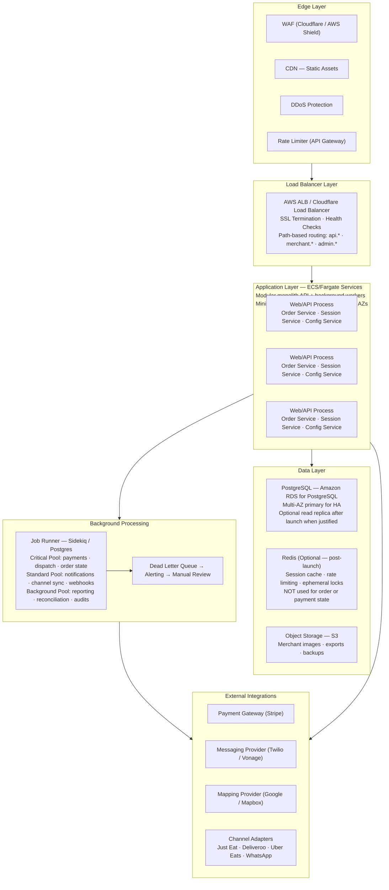
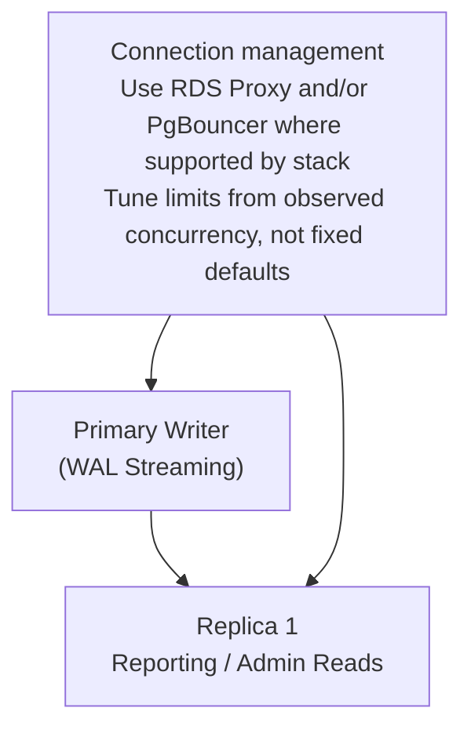
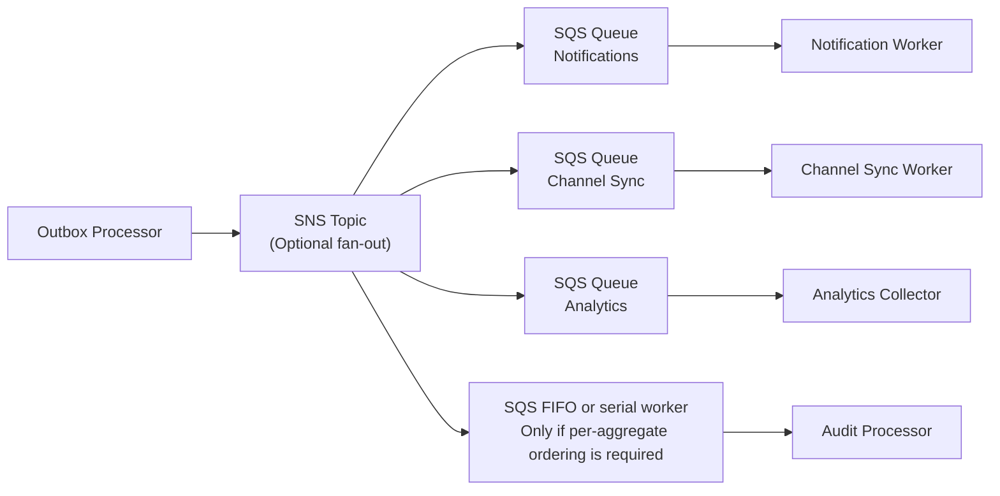
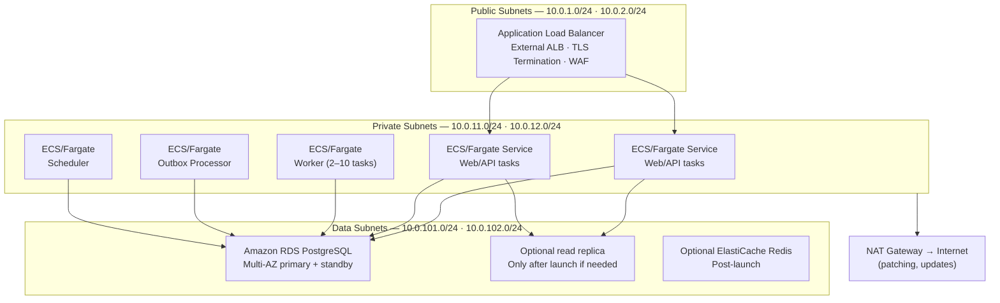
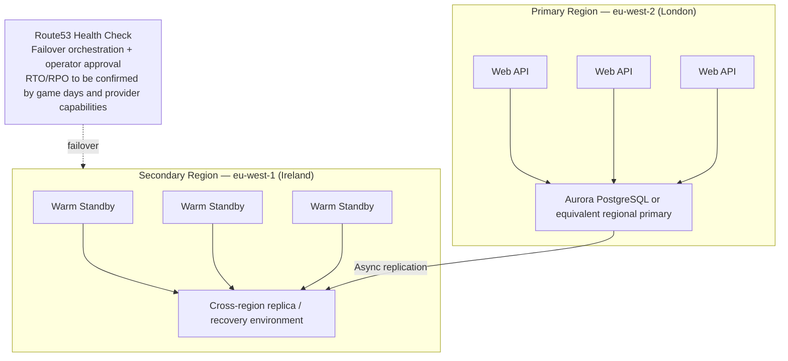
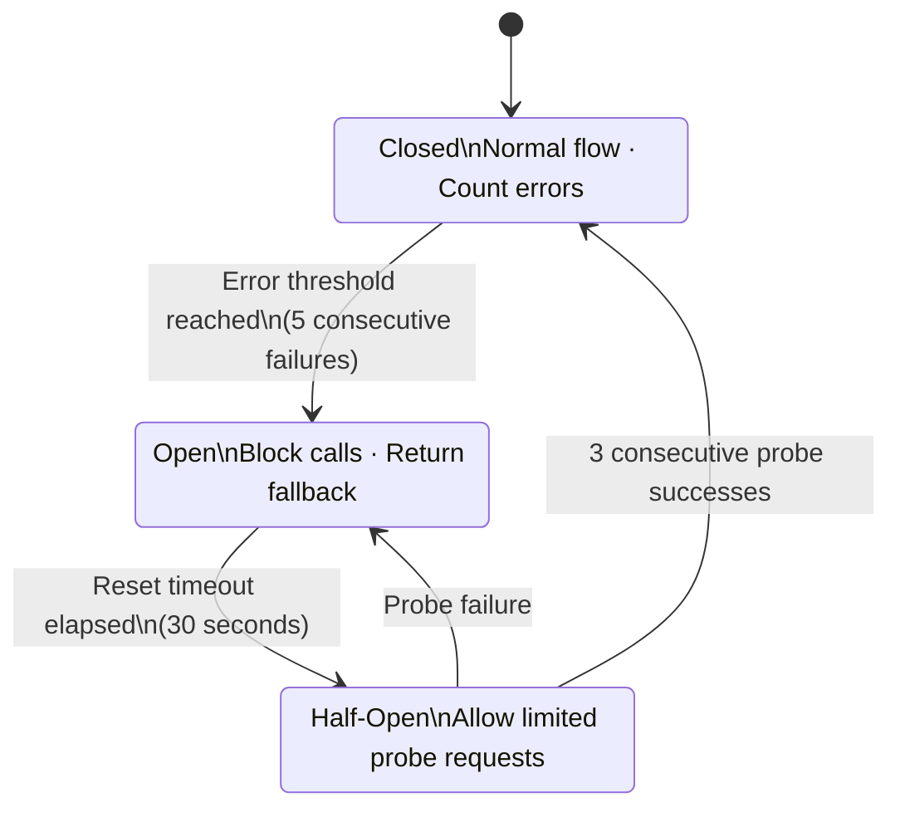

# 13 — FastBite Platform Architecture

**Document Version:** 1.1  
**Date:** May 2026  
**Author:** Engineering Manager, Platform & Reliability  
**Status:** Reviewed Reference Architecture

---

## Table of Contents

0. [MVP Build-Now View](#0-mvp-build-now-view)
1. [Architecture Principles](#1-architecture-principles)
2. [High-Level System Overview](#2-high-level-system-overview)
3. [Core Platform Components](#3-core-platform-components)
4. [Data Architecture](#4-data-architecture)
5. [Event-Driven Architecture](#5-event-driven-architecture)
6. [Deployment Topology](#6-deployment-topology)
7. [Network & Security Architecture](#7-network--security-architecture)
8. [Observability Platform](#8-observability-platform)
9. [Resilience Patterns](#9-resilience-patterns)
10. [Scale-Out Strategy](#10-scale-out-strategy)
11. [Implementation Phases](#11-implementation-phases)
12. [Architecture Constraints](#12-architecture-constraints)

---

## 0. MVP Build-Now View

This document mixes two kinds of material:

- MVP build requirements that the team needs to start implementation safely
- later-phase reference patterns that should stay out of scope until pilot evidence justifies them

For project start, treat the following as build-critical:

- sections 1 through 5 for architecture principles, service boundaries, core schema, and outbox-driven event flow
- sections 6.1 and 6.2 for the single-region AWS deployment baseline
- sections 7 through 9 for security, observability, and resilience guardrails
- section 12 for hard constraints that protect order durability and operator trust

Safe to defer until pilot load or operating pain proves the need:

- read replicas in section 4.2 unless primary load or reporting pressure justifies them
- WebSocket-driven KDS updates in section 3.2; polling is acceptable for MVP
- Redis unless sessions, rate limits, or short-lived locks become a measured bottleneck
- section 6.3 multi-region warm standby
- section 10 scale-out actions beyond the trigger logic
- post-MVP implementation sequencing inside sections 11.2 and 11.3
- appendices that support later cost planning or vendor comparison rather than day-one build choices

Use this document with the rest of the pack as follows:

- [09-roadmap-and-budget.md](./09-roadmap-and-budget.md) is the sequencing source for what happens first
- [04-product-and-operations.md](./04-product-and-operations.md) defines the operator workflows the platform must support
- [05-integrations-and-data-model.md](./05-integrations-and-data-model.md) defines the channel and canonical-data rules that this architecture must preserve

If a detail improves scale, elegance, or future optionality but is not required to capture, persist, show, and recover orders safely in one pilot zone, keep it as reference rather than MVP scope.

---

## 1. Architecture Principles

### 1.1 Foundational Tenets

| Principle                   | Description                                                                                      | Rationale                                   |
| --------------------------- | ------------------------------------------------------------------------------------------------ | ------------------------------------------- |
| **Source of Truth**         | PostgreSQL is the authoritative store for orders, state transitions, and merchant data           | Durability and consistency over speed       |
| **Fail Closed**             | New order acceptance stops when database writes cannot be confirmed                              | Zero tolerance for acknowledged order loss  |
| **Eventual Consistency OK** | Notifications, sync, and dashboards are projections                                              | Allows independent scaling and recovery     |
| **Idempotency Everywhere**  | All external-facing APIs and workers handle duplicates gracefully                                | Resiliency over simplicity                  |
| **Observability First**     | Structured logging, traces, and metrics from day one                                             | Without observability, nothing else matters |
| **Degrade Safely**          | Dependency failure should pause unsafe actions, expose real status, and preserve manual fallback | Trust matters more than hiding failure      |

### 1.2 What This Architecture Is Not

- This is **not** a microservices architecture for MVP
- This is **not** a multi-region active-active setup (reserved for post-MVP)
- This does **not** promise 99.99% availability (reserved for mature platform)
- This does **not** use Redis as a source of truth for orders

### 1.3 Scope And Stage Assumptions

- This document describes a UK-focused MVP through early growth reference architecture, not a fully optimised end-state.
- The baseline operating model is a modular monolith with background workers, PostgreSQL as system of record, and managed AWS infrastructure.
- Any numeric capacity, failover, or cost figure in this document is a planning assumption unless backed by a named vendor source or an internal load test.
- State-changing merchant and order flows prefer correctness over freshness or availability. Read-only dashboards and notifications can degrade independently.
- Low-traffic maintenance windows are acceptable for MVP. The harder requirement is that unexpected incidents do not create false confirmations or hide committed orders.
- Post-MVP features such as cross-region warm standby, service extraction, and advanced autoscaling should be gated by measured load, operational pain, or compliance needs.

---

## 2. High-Level System Overview



---

## 3. Core Platform Components

### 3.1 Order Management Service

**Responsibilities**

- Create, update, and query orders
- Enforce order state machine transitions
- Write to outbox within the same transaction
- Maintain append-only transition history

**Boundaries**

- Only this service writes the `order_state_transitions` table
- Only this service validates legal state transitions
- Other services request state changes via API — never direct DB writes

**API Surface**

| Method  | Endpoint                         | Purpose                 |
| ------- | -------------------------------- | ----------------------- |
| `POST`  | `/api/v1/orders`                 | Create order            |
| `GET`   | `/api/v1/orders/{id}`            | Get order               |
| `PATCH` | `/api/v1/orders/{id}/state`      | Transition state        |
| `GET`   | `/api/v1/orders?merchant_id=...` | List orders (paginated) |

---

### 3.2 Merchant Dashboard Service

**Responsibilities**

- Serve merchant-facing UI (web app)
- Aggregate order data for display
- Handle KDS (Kitchen Display System) updates
- Prefer primary for active order views that drive operational decisions
- Use replica only for lag-tolerant reporting or admin queries once read pressure justifies it

**Read Patterns**

- Polling every 3-5s for active orders is acceptable for MVP
- WebSocket for real-time KDS updates (optional MVP)
- If replica reads are introduced, acceptance and fulfilment screens must remain pinned to primary-backed reads until lag is measured and bounded

---

### 3.3 Dispatch Service

**Responsibilities**

- Assign orders to riders (manual or automated)
- Track rider availability and location
- Calculate ETAs using mapping provider
- Provide fallback manual dispatch console

**State Ownership**

- Manages `dispatch_assignments` table
- Transitions orders to: `dispatched`, `picked_up`, `delivered`

**Automation Threshold**

- MVP: Manual dispatch is acceptable while delivery volume is still operationally manageable by on-shift staff
- Auto-assignment should be introduced only after measuring dispatch latency, rider utilisation, and order volume by merchant cluster

---

### 3.4 Channel Adapter Service

**Responsibilities**

- Sync orders from marketplace channels (Just Eat, Deliveroo, Uber Eats)
- Push order status updates back to channels
- Handle webhooks from marketplace APIs
- Maintain `channel_credentials` securely

**Patterns**

- Idempotent webhook handlers
- Retry with exponential backoff
- Dead-letter for poison messages

**Sync Modes**

- Real-time webhook ingestion (preferred)
- Polling fallback (configurable interval)

---

### 3.5 Notification Service

**Responsibilities**

- Send order updates via SMS, WhatsApp, and push
- Template management and localisation
- Delivery tracking and opt-out management

**Guarantees**

- At-least-once delivery
- Idempotent via `notification_id`
- Best-effort — not SLA-bound in MVP

---

### 3.6 Payment Service

**Responsibilities**

- Initiate payment sessions
- Verify payment completion
- Handle webhooks from payment provider
- Manage `payment_attempts` for auditing

**Critical Rules**

- **NEVER** treat a client redirect or browser callback as proof of payment; require provider-confirmed server-side state, typically via webhook and/or server-side payment status retrieval
- Use idempotency keys for all payment API calls
- Fail closed: stop accepting new prepaid orders if provider is down

---

### 3.7 Service Communication Patterns

| Pattern                          | Used For                                                                                                                    |
| -------------------------------- | --------------------------------------------------------------------------------------------------------------------------- |
| **Synchronous (HTTP/gRPC)**      | Customer checkout, merchant dashboard reads, status queries, health checks                                                  |
| **Asynchronous (Events/Queues)** | Notifications, channel sync, payment verification, audit logging, analytics                                                 |
| **Direct Database**              | Internal module reads/writes inside the monolith boundary only; never bypass service invariants for order state transitions |

---

## 4. Data Architecture

### 4.1 Database Schema

```sql
-- =====================================================
-- CORE ORDER TABLES
-- =====================================================

CREATE TABLE orders (
    id              UUID PRIMARY KEY DEFAULT gen_random_uuid(),
    merchant_id     UUID NOT NULL REFERENCES merchants(id),
    customer_id     UUID REFERENCES customers(id),
    channel         VARCHAR(50) NOT NULL DEFAULT 'direct',
    external_id     VARCHAR(255),

    -- Order Content
    items           JSONB NOT NULL,
    subtotal        DECIMAL(10,2) NOT NULL,
    tax_amount      DECIMAL(10,2) NOT NULL DEFAULT 0,
    delivery_fee    DECIMAL(10,2) NOT NULL DEFAULT 0,
    total_amount    DECIMAL(10,2) NOT NULL,

    -- Delivery Info
    delivery_address     JSONB NOT NULL,
    customer_phone       VARCHAR(20),
    customer_name        VARCHAR(255),
    special_instructions TEXT,

    -- State
    status          VARCHAR(50) NOT NULL DEFAULT 'pending',
    payment_status  VARCHAR(50) NOT NULL DEFAULT 'pending',
    payment_method  VARCHAR(50),

    -- Timestamps
    created_at      TIMESTAMPTZ NOT NULL DEFAULT NOW(),
    updated_at      TIMESTAMPTZ NOT NULL DEFAULT NOW(),
    accepted_at     TIMESTAMPTZ,
    ready_at        TIMESTAMPTZ,
    picked_up_at    TIMESTAMPTZ,
    delivered_at    TIMESTAMPTZ,
    cancelled_at    TIMESTAMPTZ,
    cancellation_reason TEXT,

    -- Idempotency
    idempotency_key VARCHAR(255) UNIQUE,

    -- Soft delete (never hard-delete orders)
    deleted_at      TIMESTAMPTZ,

    CONSTRAINT valid_status CHECK (status IN (
        'pending', 'confirmed', 'preparing', 'ready',
        'dispatched', 'picked_up', 'delivered',
        'cancelled', 'refunded'
    )),
    CONSTRAINT valid_payment_status CHECK (payment_status IN (
        'pending', 'processing', 'completed', 'failed', 'refunded'
    ))
);

CREATE INDEX idx_orders_merchant_status ON orders(merchant_id, status);
CREATE INDEX idx_orders_channel_external ON orders(channel, external_id) WHERE external_id IS NOT NULL;
CREATE INDEX idx_orders_created_at ON orders(created_at DESC);
CREATE INDEX idx_orders_idempotency ON orders(idempotency_key) WHERE idempotency_key IS NOT NULL;


CREATE TABLE order_state_transitions (
    id              UUID PRIMARY KEY DEFAULT gen_random_uuid(),
    order_id        UUID NOT NULL REFERENCES orders(id),
    from_status     VARCHAR(50),
    to_status       VARCHAR(50) NOT NULL,
    triggered_by    VARCHAR(100) NOT NULL,
    triggered_by_id VARCHAR(255),
    reason          TEXT,
    metadata        JSONB,
    created_at      TIMESTAMPTZ NOT NULL DEFAULT NOW(),
    CONSTRAINT valid_transition CHECK (from_status IS DISTINCT FROM to_status)
);

CREATE INDEX idx_transitions_order ON order_state_transitions(order_id, created_at DESC);


-- =====================================================
-- TRANSACTIONAL OUTBOX (for reliable event emission)
-- =====================================================

CREATE TABLE outbox (
    id              UUID PRIMARY KEY DEFAULT gen_random_uuid(),
    aggregate_type  VARCHAR(100) NOT NULL,
    aggregate_id    UUID NOT NULL,
    event_type      VARCHAR(100) NOT NULL,
    event_payload   JSONB NOT NULL,
    status          VARCHAR(20) NOT NULL DEFAULT 'pending',
    attempts        INTEGER NOT NULL DEFAULT 0,
    last_attempt_at TIMESTAMPTZ,
    processed_at    TIMESTAMPTZ,
    error_message   TEXT,
    created_at      TIMESTAMPTZ NOT NULL DEFAULT NOW(),
    CONSTRAINT valid_outbox_status CHECK (status IN ('pending', 'processing', 'completed', 'failed'))
);

CREATE INDEX idx_outbox_pending ON outbox(created_at) WHERE status = 'pending';
CREATE INDEX idx_outbox_status  ON outbox(status, created_at);


-- =====================================================
-- PAYMENT TRACKING
-- =====================================================

CREATE TABLE payment_attempts (
    id              UUID PRIMARY KEY DEFAULT gen_random_uuid(),
    order_id        UUID NOT NULL REFERENCES orders(id),
    provider        VARCHAR(50) NOT NULL,
    provider_ref    VARCHAR(255),
    amount          DECIMAL(10,2) NOT NULL,
    currency        VARCHAR(3) NOT NULL DEFAULT 'GBP',
    status          VARCHAR(50) NOT NULL,
    failure_code    VARCHAR(100),
    failure_message TEXT,
    idempotency_key VARCHAR(255) NOT NULL,
    webhook_received_at TIMESTAMPTZ,
    processed_at        TIMESTAMPTZ,
    created_at          TIMESTAMPTZ NOT NULL DEFAULT NOW(),
    CONSTRAINT valid_payment_status CHECK (status IN (
        'pending', 'processing', 'succeeded', 'failed', 'cancelled', 'refunded'
    ))
);

CREATE INDEX idx_payments_order        ON payment_attempts(order_id);
CREATE INDEX idx_payments_provider_ref ON payment_attempts(provider, provider_ref);


-- =====================================================
-- DISPATCH
-- =====================================================

CREATE TABLE riders (
    id               UUID PRIMARY KEY DEFAULT gen_random_uuid(),
    name             VARCHAR(255) NOT NULL,
    phone            VARCHAR(20) NOT NULL UNIQUE,
    email            VARCHAR(255),
    status           VARCHAR(50) NOT NULL DEFAULT 'offline',
    current_location GEOGRAPHY(POINT, 4326),
    last_location_at TIMESTAMPTZ,
    created_at       TIMESTAMPTZ NOT NULL DEFAULT NOW(),
    updated_at       TIMESTAMPTZ NOT NULL DEFAULT NOW()
);

CREATE INDEX idx_riders_status ON riders(status);


CREATE TABLE dispatch_assignments (
    id                 UUID PRIMARY KEY DEFAULT gen_random_uuid(),
    order_id           UUID NOT NULL REFERENCES orders(id),
    rider_id           UUID NOT NULL REFERENCES riders(id),
    assigned_at        TIMESTAMPTZ NOT NULL DEFAULT NOW(),
    accepted_at        TIMESTAMPTZ,
    picked_up_at       TIMESTAMPTZ,
    delivered_at       TIMESTAMPTZ,
    status             VARCHAR(50) NOT NULL DEFAULT 'assigned',
    failure_reason     TEXT,
    pickup_eta         INTEGER,
    delivery_eta       INTEGER,
    route_distance_km  DECIMAL(6,2),
    actual_distance_km DECIMAL(6,2)
);

CREATE INDEX idx_dispatch_order        ON dispatch_assignments(order_id);
CREATE INDEX idx_dispatch_rider_status ON dispatch_assignments(rider_id, status);


-- =====================================================
-- MERCHANTS
-- =====================================================

CREATE TABLE merchants (
    id         UUID PRIMARY KEY DEFAULT gen_random_uuid(),
    name       VARCHAR(255) NOT NULL,
    slug       VARCHAR(255) NOT NULL UNIQUE,
    email      VARCHAR(255) NOT NULL,
    phone      VARCHAR(20),
    address    JSONB NOT NULL,
    location   GEOGRAPHY(POINT, 4326),
    settings   JSONB DEFAULT '{}',
    status     VARCHAR(50) NOT NULL DEFAULT 'pending',
    created_at TIMESTAMPTZ NOT NULL DEFAULT NOW(),
    updated_at TIMESTAMPTZ NOT NULL DEFAULT NOW()
);

CREATE TABLE channel_credentials (
    id          UUID PRIMARY KEY DEFAULT gen_random_uuid(),
    merchant_id UUID NOT NULL REFERENCES merchants(id),
    channel     VARCHAR(50) NOT NULL,
    credentials JSONB NOT NULL,
    settings    JSONB DEFAULT '{}',
    last_sync_at TIMESTAMPTZ,
    sync_status  VARCHAR(50) DEFAULT 'ok',
    created_at  TIMESTAMPTZ NOT NULL DEFAULT NOW(),
    updated_at  TIMESTAMPTZ NOT NULL DEFAULT NOW(),
    UNIQUE(merchant_id, channel)
);


-- =====================================================
-- AUDIT & COMPLIANCE
-- =====================================================

CREATE TABLE audit_log (
    id          UUID PRIMARY KEY DEFAULT gen_random_uuid(),
    entity_type VARCHAR(100) NOT NULL,
    entity_id   UUID NOT NULL,
    action      VARCHAR(50) NOT NULL,
    actor_type  VARCHAR(50) NOT NULL,
    actor_id    VARCHAR(255),
    actor_ip    INET,
    changes     JSONB,
    metadata    JSONB,
    created_at  TIMESTAMPTZ NOT NULL DEFAULT NOW()
);

CREATE INDEX idx_audit_entity ON audit_log(entity_type, entity_id);
CREATE INDEX idx_audit_actor  ON audit_log(actor_type, actor_id);
CREATE INDEX idx_audit_time   ON audit_log(created_at DESC);


CREATE TABLE webhook_events (
    id           UUID PRIMARY KEY DEFAULT gen_random_uuid(),
    source       VARCHAR(50) NOT NULL,
    event_type   VARCHAR(100) NOT NULL,
    payload      JSONB NOT NULL,
    payload_hash VARCHAR(64) NOT NULL,
    status       VARCHAR(50) NOT NULL DEFAULT 'received',
    attempts     INTEGER NOT NULL DEFAULT 0,
    processed_at TIMESTAMPTZ,
    error_message TEXT,
    created_at   TIMESTAMPTZ NOT NULL DEFAULT NOW(),
    CONSTRAINT valid_webhook_status CHECK (status IN (
        'received', 'processing', 'completed', 'failed', 'ignored'
    ))
);

CREATE INDEX idx_webhook_hash   ON webhook_events(payload_hash);
CREATE INDEX idx_webhook_source ON webhook_events(source, created_at DESC);
```

### 4.2 Read Replica Strategy

Read replicas are a scale-out tool for read-heavy workloads, not a substitute for Multi-AZ high availability. Amazon RDS read replicas replicate asynchronously, so stale reads and lag must be assumed unless measured otherwise.

**Staged plan**

- MVP launch: run against the primary database only, with Multi-AZ enabled for failover.
- Early growth: add one read replica for reporting, admin queries, or merchant history pages if primary CPU, IOPS, or connection pressure warrants it.
- Later growth: add more replicas only after query profiling shows durable benefit and operational ownership exists for lag monitoring and read-routing.

**Read-routing rules**

- Order acceptance, payment confirmation, dispatch decisions, and any state-changing flow must read from primary-backed paths.
- Replica-backed queries must be explicitly tagged as lag-tolerant.
- Alerts should fire on replica lag and connection saturation before replicas are treated as customer-visible dependencies.



---

## 5. Event-Driven Architecture

### 5.1 Transactional Outbox Pattern

All order changes are written atomically: the order record and outbox row are committed in the same database transaction. This removes the dual-write gap between database state and downstream event publication. It does not remove the need for idempotent consumers, ordering controls, and outbox replay tooling.

**Step 1 — Application Transaction (single DB transaction)**

```sql
BEGIN;

  INSERT INTO orders (...) VALUES (...);

  INSERT INTO order_state_transitions
    (order_id, from_status, to_status, triggered_by)
  VALUES
    ('<new_order_id>', NULL, 'confirmed', 'order_service');

  INSERT INTO outbox
    (aggregate_type, aggregate_id, event_type, event_payload)
  VALUES
    ('order', '<new_order_id>', 'order.created', '{"order_id": "..."}');

COMMIT;
-- Order is durable AND event is queued atomically
```

**Step 2 — Outbox Processor (separate worker, configurable short polling interval)**

```
SELECT * FROM outbox
WHERE status = 'pending'
ORDER BY created_at ASC
LIMIT 100;

FOR EACH event:
  TRY
    Publish to message broker (for example SQS or SNS)
    UPDATE outbox SET status = 'completed' WHERE id = event.id
  CATCH
    UPDATE outbox SET
      attempts        = attempts + 1,
      last_attempt_at = NOW(),
      error_message   = <error>
    WHERE id = event.id

    IF attempts > 5 THEN
      UPDATE outbox SET status = 'failed'
      INSERT INTO dead_letter_queue (...)
    END IF
```

**Operational notes**

- Outbox consumers must tolerate duplicate delivery.
- If downstream ordering matters, preserve per-aggregate ordering explicitly instead of assuming standard queues will maintain it.
- The outbox table needs retention and replay procedures so it does not grow without bound.

### 5.2 Event Schema

```json
{
  "event_id": "uuid-v4",
  "event_type": "order.created",
  "aggregate_type": "order",
  "aggregate_id": "uuid-v4",
  "occurred_at": "2026-05-18T10:30:00Z",
  "producer": "order-service",
  "schema_version": "1.0",
  "payload": {
    "order_id": "uuid-v4",
    "merchant_id": "uuid-v4",
    "customer_id": "uuid-v4",
    "channel": "direct",
    "status": "confirmed",
    "total_amount": 25.99,
    "currency": "GBP",
    "items": ["..."]
  },
  "metadata": {
    "correlation_id": "uuid-v4",
    "causation_id": "uuid-v4",
    "user_id": "uuid-v4"
  }
}
```

### 5.3 Event Consumers

For MVP, the safest default is direct publication from the outbox processor to a small number of queues or topics. Use SNS fan-out only where one event genuinely feeds multiple independent consumers. Use FIFO queues only for flows that require ordering and deduplication semantics; standard queues are appropriate where at-least-once and best-effort ordering are acceptable.



---

## 6. Deployment Topology

### 6.1 AWS Infrastructure Layout

Primary Region: **eu-west-2 (London)** · VPC `10.0.0.0/16`

This topology assumes one production region for MVP. Multi-AZ is the HA mechanism at launch; cross-region failover is a later investment.



### 6.2 Representative ECS/Fargate Configuration

The task definition and autoscaling policy are separate concerns in ECS. The task definition defines runtime parameters for the container. Service autoscaling is configured through Application Auto Scaling against the ECS service.

**MVP In-Flight Request Baseline — Instance Sizing**

| Component        | CPU             | Memory     | Instance Count                  | Notes                                                |
| ---------------- | --------------- | ---------- | ------------------------------- | ---------------------------------------------------- |
| Web/API task     | 2048 (2 vCPU)   | 4096 (4GB) | 4–6 (min 2 per AZ across 2 AZs) | Request handling, session management, hot read paths |
| Worker task      | 512 (0.5 vCPU)  | 2048 (2GB) | 2–4 (auto-scaled)               | Async processing, lower CPU pressure                 |
| Outbox processor | 256 (0.25 vCPU) | 1024 (1GB) | 1–2                             | Lightweight relay, DB polling                        |

**Auto-scaling Configuration**

| Service | Scale-Up Trigger                            | Scale-Down Trigger          | Min | Max |
| ------- | ------------------------------------------- | --------------------------- | --- | --- |
| Web/API | CPU > 60% OR ALB response > 300ms for 2 min | CPU < 30% for 5 min         | 4   | 12  |
| Worker  | Queue depth > 100 messages for 2 min        | Queue depth < 20 for 10 min | 2   | 8   |

**Database Capacity for MVP In-Flight Requests**

| Component               | Specification                        | Concurrent Connections                          |
| ----------------------- | ------------------------------------ | ----------------------------------------------- |
| RDS PostgreSQL          | db.r6g.xlarge writer (4 vCPU / 32GB) | 80–120 active writer connections target         |
| PgBouncer               | Transaction mode, pool size 100–150  | Handles MVP in-flight requests via multiplexing |
| Target connections used | < 120                                | Leaves failover and maintenance headroom        |

```json
{
  "family": "fastbite-web-api",
  "requiresCompatibilities": ["FARGATE"],
  "networkMode": "awsvpc",
  "cpu": "2048",
  "memory": "4096",
  "executionRoleArn": "arn:aws:iam::<account-id>:role/fastbite-ecs-execution",
  "taskRoleArn": "arn:aws:iam::<account-id>:role/fastbite-web-api",
  "containerDefinitions": [
    {
      "name": "web-api",
      "image": "<account>.dkr.ecr.eu-west-2.amazonaws.com/fastbite-web-api:<image-tag>",
      "essential": true,
      "portMappings": [
        {
          "containerPort": 3000,
          "protocol": "tcp"
        }
      ],
      "healthCheck": {
        "command": [
          "CMD-SHELL",
          "curl -f http://localhost:3000/health || exit 1"
        ],
        "interval": 30,
        "timeout": 5,
        "retries": 3,
        "startPeriod": 60
      },
      "environment": [
        { "name": "RAILS_ENV", "value": "production" },
        { "name": "RAILS_LOG_LEVEL", "value": "info" },
        { "name": "DATABASE_POOL_SIZE", "value": "20" }
      ],
      "secrets": [
        {
          "name": "DATABASE_URL",
          "valueFrom": "arn:aws:secretsmanager:eu-west-2:<account-id>:secret:fastbite/db-url"
        },
        {
          "name": "SECRET_KEY_BASE",
          "valueFrom": "arn:aws:secretsmanager:eu-west-2:<account-id>:secret:fastbite/secret-key"
        }
      ],
      "logConfiguration": {
        "logDriver": "awslogs",
        "options": {
          "awslogs-group": "/ecs/fastbite/web-api",
          "awslogs-region": "eu-west-2",
          "awslogs-stream-prefix": "ecs",
          "mode": "non-blocking",
          "max-buffer-size": "25m"
        }
      },
      "readonlyRootFilesystem": true
    }
  ]
}
```

**Service-level deployment and scaling defaults**

- Start with minimum 2 API tasks across multiple AZs.
- Use ECS rolling deployment defaults such as 100% minimum healthy and 200% maximum during deploys.
- Use target tracking on CPU or memory first; add latency- or queue-based policies only after metrics are stable.
- Keep worker scaling separate from API scaling so background spikes do not distort customer-facing capacity.

### 6.3 Multi-Region Warm Standby (Post-MVP)

Cross-region failover is a later resilience investment, not an MVP baseline. If adopted, the operating cost and operational burden increase materially and the application layer must be tested for failover, secret replication, job deduplication, and control-plane recovery.



---

## 7. Network & Security Architecture

### 7.1 Defence in Depth

**Layer 1 — Edge Protection**

- Choose one primary edge stack for MVP, for example CloudFront + AWS WAF or Cloudflare, instead of running overlapping controls without clear ownership
- DDoS protection through provider defaults and enhanced controls where justified
- WAF rules: rate limiting, geo-blocking, SQL injection, XSS
- Minimum TLS 1.2; prefer TLS 1.3 where supported end-to-end
- HSTS headers (`max-age: 1 year`)

**Layer 2 — Network Security**

- VPC with public/private subnets
- Security Groups: restrictive inbound (only port 443 from ALB)
- NACLs: subnet-level filtering
- Private subnets for database, Redis, and application tiers
- NAT Gateway for outbound (no direct internet from application tier)

**Layer 3 — Application Security**

- Authentication: JWT with short expiry (15 min) + refresh tokens
- Authorisation: Role-based (merchant, rider, admin, customer)
- API: OAuth 2.0 / API keys for marketplace integrations
- Input validation on all endpoints
- Rate limiting per client/user
- Request signing for webhook authenticity

**Layer 4 — Data Security**

- Encryption at rest: AES-256 (RDS, Redis, S3)
- Encryption in transit: TLS 1.2+
- Secrets: AWS Secrets Manager; enable automatic rotation where the integration supports it, otherwise enforce scheduled manual rotation
- PII: classify fields explicitly; mask in logs and apply field-level encryption selectively where business or regulatory risk warrants it
- Payment scope: minimise PCI exposure by using hosted payment collection/tokenisation patterns; do not assume reduced scope unless the implemented flow supports it

**Layer 5 — Monitoring & Response**

- AWS GuardDuty: threat detection
- AWS Security Hub: centralised findings
- CloudTrail: API activity audit
- Intrusion detection via VPC Flow Logs + Athena
- Automated incident response via EventBridge + Lambda

### 7.2 Secrets Management

Rotation intervals below are control targets, not guarantees. Some third-party credentials will require manual runbooks rather than native automatic rotation.

```yaml
# secrets-management.yaml
version: "1.0"

secrets_categories:
  database_credentials:
    rotation: 30_days
    storage: AWS Secrets Manager
    audit: CloudTrail enabled

  payment_provider_keys:
    rotation: 90_days
    storage: AWS Secrets Manager
    audit: CloudTrail enabled + dedicated secret

  api_keys_marketplace:
    rotation: 90_days
    storage: AWS Secrets Manager
    audit: CloudTrail enabled + dedicated secret

  encryption_keys:
    rotation: 365_days
    storage: AWS KMS (Customer Managed Keys)
    audit: CloudTrail enabled

  messaging_provider_tokens:
    rotation: 60_days
    storage: AWS Secrets Manager
    audit: CloudTrail enabled
```

---

## 8. Observability Platform

### 8.1 Metrics

MVP baseline should favour managed collection over a bespoke observability estate. CloudWatch and ECS Container Insights are sufficient at launch; managed Prometheus/Grafana or a hosted observability platform can be added once query depth and retention requirements exceed the baseline.

**Infrastructure**

- CPU, Memory, Disk I/O per container
- Network throughput and packet rates
- RDS: connections, queries/sec, replication lag
- Redis: memory, hit rate, commands/sec

**Application — RED Method**

- **Rate:** requests per second by endpoint
- **Errors:** 5xx rate, error types
- **Duration:** p50 / p95 / p99 latency

**Business Metrics**

- Orders created per minute
- Order state transitions by type
- Payment success/failure rate
- Dispatch time (ready → assigned)

**Queue Metrics**

- Backlog depth by queue
- Message age (oldest message)
- Consumer lag

**External Dependencies**

- Payment provider: success rate, p99 latency
- Messaging provider: delivery rate, latency
- Mapping provider: geocoding success rate

### 8.2 Logs

CloudWatch should be the operational system of record for live triage. S3 archive is for retention, not real-time investigation.

Structured JSON format:

```json
{
  "timestamp": "ISO8601",
  "level": "INFO|WARN|ERROR",
  "service": "order-service",
  "trace_id": "uuid",
  "span_id": "uuid",
  "message": "...",
  "metadata": {}
}
```

**Log levels by environment**

- Production: `INFO`, `WARN`, `ERROR`
- Debug: `DEBUG` (enabled via feature flag, time-limited)

**Retention policy**

| Tier    | Storage    | Duration                                                      |
| ------- | ---------- | ------------------------------------------------------------- |
| Hot     | CloudWatch | 30 days                                                       |
| Warm    | S3         | 90 days                                                       |
| Archive | S3 Glacier | 1 year or policy-driven archival; restore required for access |

### 8.3 Traces (OpenTelemetry + backend)

Use OpenTelemetry instrumentation so trace data can be sent to AWS X-Ray or another OTLP-compatible backend later without rewriting application instrumentation.

**Distributed tracing covers:**

- HTTP requests across services
- Database queries (with bind parameters)
- Queue message production and consumption
- External API calls

**Trace attributes:** `service.name`, `operation.name`, `order.id`, `merchant.id`, `user.id`

**Sampling strategy**

- MVP default: head-based sampling at a conservative rate for successful traffic, with explicit capture of error traces
- Tail-based sampling should only be promised if an OpenTelemetry Collector or equivalent backend path is deployed and operated

### 8.4 Dashboard Examples

```yaml
# Grafana Dashboard: Order Flow Health
title: FastBite - Order Flow Health
panels:
  - title: Order Intake Rate
    type: timeseries
    targets:
      - expr: sum(rate(fastbite_orders_created_total[5m])) by (channel)
    alert:
      condition: rate < 0.1
      duration: 5m
      annotations:
        summary: "Order intake rate below threshold"

  - title: Order Create Latency (p95)
    type: gauge
    targets:
      - expr: histogram_quantile(0.95, sum(rate(fastbite_order_create_duration_bucket[5m])) by (le))
    alert:
      condition: value > 1000
      duration: 5m
      annotations:
        summary: "Order creation p95 > 1 second"

  - title: Payment Success Rate
    type: stat
    targets:
      - expr: sum(rate(fastbite_payments_completed_total[5m])) / sum(rate(fastbite_payments_attempted_total[5m]))
    alert:
      condition: value < 0.99
      annotations:
        summary: "Payment success rate < 99%"

  - title: Queue Backlog Age
    type: timeseries
    targets:
      - expr: max(fastbite_queue_oldest_message_age_seconds) by (queue_name)
    alert:
      condition: value > 900
      annotations:
        summary: "Queue backlog age > 15 minutes"
```

### 8.5 Alerting Rules

```yaml
# alerting-rules.yaml
groups:
  - name: fastbite-critical
    interval: 30s
    rules:
      - alert: OrderIntakeDown
        expr: >
          sum(rate(fastbite_orders_created_total[5m])) == 0
          and on() (hour() >= 10 and hour() < 23)
        for: 2m
        labels:
          severity: critical
        annotations:
          summary: "No orders created in 5 minutes during service window"
          runbook_url: "https://wiki.fastbite.io/runbooks/order-intake-down"
          note: >-
            Alert is gated to service hours (10:00–23:00 UTC) to prevent
            constant firing overnight during the pilot. Adjust hour() bounds
            to match the agreed merchant service window before expanding to
            multiple time zones or extended hours.

      - alert: DatabaseUnavailable
        expr: fastbite_database_connections_active / fastbite_database_max_connections > 0.95
        for: 1m
        labels:
          severity: critical
        annotations:
          summary: "Database connection pool near capacity"

      - alert: DatabaseWriteLatency
        expr: histogram_quantile(0.99, sum(rate(fastbite_db_write_duration_seconds_bucket[5m])) by (le)) > 5
        for: 3m
        labels:
          severity: critical
        annotations:
          summary: "Database write latency > 5 seconds"

  - name: fastbite-warning
    interval: 60s
    rules:
      - alert: HighErrorRate
        expr: sum(rate(fastbite_http_requests_total{status=~"5.."}[5m])) / sum(rate(fastbite_http_requests_total[5m])) > 0.01
        for: 5m
        labels:
          severity: warning

      - alert: QueueBacklogGrowing
        expr: predict_linear(fastbite_queue_messages_total[15m], 3600) > 10000
        for: 10m
        labels:
          severity: warning

      - alert: PaymentProviderDegraded
        expr: sum(rate(fastbite_payment_provider_errors_total[5m])) / sum(rate(fastbite_payment_provider_requests_total[5m])) > 0.05
        for: 5m
        labels:
          severity: warning
```

---

## 9. Resilience Patterns

### 9.1 Circuit Breaker State Machine



**Configuration per dependency**

| Dependency                  | Failure Threshold | Reset Timeout | Half-Open Max Calls | Fallback                                                                                             |
| --------------------------- | ----------------- | ------------- | ------------------- | ---------------------------------------------------------------------------------------------------- |
| Payment Gateway (Stripe)    | 3                 | 30s           | 5                   | Block new prepaid checkouts; allow manual review or offline-approved fallback only if policy permits |
| Messaging Provider (Twilio) | 5                 | 60s           | 10                  | Log notification; skip SMS; rely on app push                                                         |
| Mapping Provider (Mapbox)   | 5                 | 120s          | 3                   | Use cached addresses; coarse ETAs; manual routing                                                    |

### 9.2 Retry Policies

```yaml
# retry-policies.yaml
version: "1.0"

retry_policies:
  payment_create:
    max_attempts: 5
    initial_delay: 100ms
    max_delay: 30s
    backoff_multiplier: 2
    jitter: true
    retryable_errors: [408, 429, 500, 502, 503, 504]
    non_retryable_errors: [400, 401, 402, 404]

  webhook_delivery:
    max_attempts: 8
    initial_delay: 1s
    max_delay: 5m
    backoff_multiplier: 1.5
    jitter: true

  notification_sms:
    max_attempts: 3
    initial_delay: 5s
    max_delay: 60s
    backoff_multiplier: 3
    jitter: true

  channel_sync:
    max_attempts: 3
    initial_delay: 10s
    max_delay: 5m
    backoff_multiplier: 2
    jitter: true
```

### 9.3 Fallback Behaviours

| Dependency Failure | Detection                         | Fallback Behaviour                                                                                    | Recovery                                                |
| ------------------ | --------------------------------- | ----------------------------------------------------------------------------------------------------- | ------------------------------------------------------- |
| Payment Gateway    | Circuit breaker open              | Block new prepaid checkouts; allow cash-on-delivery or manual fallback only if product policy permits | Restore after provider health and reconciliation checks |
| Messaging Provider | 5xx responses, timeouts           | Log notification; mark customer comms as delayed; continue processing from canonical order state      | Background retry queue processes when healthy           |
| Mapping/Geocoding  | Timeout > 3s, 5xx                 | Use stored address; show "ETA TBD"; allow manual dispatch                                             | Automatic retry with degraded quality flag              |
| Channel Webhook    | Connection refused, timeout       | Fall back to polling (every 60s); mark connector degraded; alert ops                                  | Switch to real-time after 3 successful polls            |
| Database Primary   | Connection failure, write timeout | Stop accepting new orders; show "temporarily unavailable"; do not acknowledge uncertain orders        | Wait for RDS failover (~2–3 min)                        |
| Redis (optional)   | Connection failure                | Fall back to database session storage; degraded cache only                                            | Automatic reconnection                                  |

---

## 10. Scale-Out Strategy

### 10.1 Scaling Triggers

**Web/API Service (ECS Fargate) — MVP In-Flight Request Baseline**

| Metric                   | Scale Up                  | Scale Down       |
| ------------------------ | ------------------------- | ---------------- |
| CPU utilisation          | > 60% for 2 min           | < 30% for 5 min  |
| Memory utilisation       | > 80% for 2 min           | —                |
| ALB target response time | sustained > 300ms         | —                |
| Request count            | > 800 in-flight for 2 min | < 400 for 10 min |

Capacity starting point: **Min 2–4 · Max 12 · Spread across 2 AZs · At least 1 per AZ**

> **Pilot note:** Start at Min 2 tasks for the 3–5 merchant pilot. At ~150–250 orders/day peak, 2 tasks across 2 AZs is sufficient. Raise the floor to 4 only once sustained load or operational confidence justifies the cost. This is consistent with the 2–4 instance baseline in the MVP reliability proposal.

**Worker Service (Background Jobs)**

| Metric                               | Scale Up                   | Scale Down               |
| ------------------------------------ | -------------------------- | ------------------------ |
| Queue depth                          | > 100 messages for 2 min   | < 20 messages for 10 min |
| Oldest message age (critical queues) | > 5 min                    | —                        |
| Consumer lag                         | > 1,000 messages for 2 min | —                        |
| DLQ depth                            | > 10 messages              | —                        |

Capacity: **Min 2 · Max 8 · Concurrency 10/worker (80 total)**

**Database (RDS PostgreSQL) — MVP In-Flight Request Context**

| Horizon     | Trigger                                                      | Action                                                             |
| ----------- | ------------------------------------------------------------ | ------------------------------------------------------------------ |
| Short-term  | Writer free connections < 20% or writer CPU > 80% for 10 min | Vertical scale: db.r6g.xlarge → db.r6g.2xlarge                     |
| Medium-term | Replication lag > 1s or read latency > 100ms                 | Add a read replica if dashboard or status traffic justifies it     |
| Long-term   | Persistent hotspotting or tenant isolation needs proven      | Consider partitioning, archiving, or decomposition before sharding |

**Connection Pool Sizing for MVP In-Flight Requests**

| Parameter                        | Value                                      | Notes                                                     |
| -------------------------------- | ------------------------------------------ | --------------------------------------------------------- |
| Writer target active connections | 80–120                                     | Keep headroom for failover and maintenance                |
| PgBouncer pool size              | 100–150                                    | Transaction mode                                          |
| Target utilization               | < 60% on the writer                        | Leaves failover headroom                                  |
| Application pool size            | 20 per instance                            | With 4–6 instances, this caps the app-side pool at 80–120 |
| Critical action                  | Cap per-instance pools in container config | Prevent connection storms during scaling and failover     |

**Redis (ElastiCache) — MVP In-Flight Request Context**

| Metric             | Scale Up            | Scale Down        |
| ------------------ | ------------------- | ----------------- |
| Memory utilisation | > 10 GB for 5 min   | < 6 GB for 15 min |
| CPU utilisation    | > 70% for 5 min     | —                 |
| Eviction rate      | > 100 evictions/sec | —                 |
| Connection count   | > 5,000             | —                 |

### 10.2 Service Decomposition Roadmap

| Phase       | Volume                  | Architecture                                     | Key Additions                                                     |
| ----------- | ----------------------- | ------------------------------------------------ | ----------------------------------------------------------------- |
| **MVP**     | 0–500 orders/day        | Single monolith with internal modules            | Single RDS, single worker process                                 |
| **Phase 1** | 500–2,000 orders/day    | Split workers into separate deployment           | Read replica if justified, dedicated queue monitoring             |
| **Phase 2** | 2,000–10,000 orders/day | Extract highest-churn integration surfaces first | Redis if hot paths prove it, stronger worker autoscaling          |
| **Phase 3** | 10,000+ orders/day      | Selective service extraction                     | Event streaming only if queue semantics and throughput require it |

**Triggers for decomposition**

- Independent scaling needs (one component needs more resources than others)
- Deployment coupling causing incidents (deploying A breaks B)
- Team ownership boundaries justify service ownership
- Security/compliance isolation requirements
- Different SLA targets per component

---

## 11. Implementation Phases

> **Timeline orientation:** The week numbers below are engineering weeks from project start, not from merchant go-live. Phase 0 (pre-pilot setup) in the roadmap runs in parallel with the early build weeks. Target first merchant go-live at approximately the end of Week 8. Channel integration work (Weeks 9–14) and reliability hardening (Weeks 15–20) therefore run during or after the live pilot, not as a prerequisite to it. Cross-reference [09-roadmap-and-budget.md](./09-roadmap-and-budget.md) for the phase gate conditions that must be met before expanding the merchant cohort or channel scope.

### 11.1 Phase 1 — MVP Foundation (Weeks 1–8)

**Weeks 1–2: Infrastructure Setup**

- [ ] VPC with public/private subnets
- [ ] RDS PostgreSQL (Multi-AZ) with initial schema
- [ ] ECS Fargate for web application
- [ ] ALB with health checks
- [ ] Route53 DNS configuration
- [ ] SSL/TLS certificates

**Weeks 3–4: Core Order Flow**

- [ ] Order creation API with idempotency
- [ ] Order state machine implementation
- [ ] Transactional outbox table
- [ ] Outbox processor worker
- [ ] Payment webhook handler (Stripe)
- [ ] Order status API

**Weeks 5–6: Merchant Experience**

- [ ] Merchant authentication and authorisation
- [ ] Dashboard backend API
- [ ] Active orders listing (with replication lag awareness)
- [ ] Order acceptance/rejection
- [ ] Order status update endpoints
- [ ] Basic KDS view

**Weeks 7–8: Notifications & Testing**

- [ ] Notification worker (Twilio/Vonage)
- [ ] WhatsApp integration
- [ ] Synthetic monitoring tests
- [ ] Load testing using realistic order mix and state-transition profile
- [ ] Failover drill (RDS primary switchover)
- [ ] Runbook documentation
- [ ] SLO dashboards

### 11.2 Phase 2 — Channel Integrations (Weeks 9–14)

> **Scope gate:** The pilot (Phase 1 in the roadmap) requires one direct-order flow and one marketplace ingestion path — not all three marketplaces. Build the adapter framework and one named marketplace first. Add the second and third only after the pilot produces evidence that the first integration is stable and merchant demand justifies the next. See [09-roadmap-and-budget.md §Phase 1 to Phase 2 gate](./09-roadmap-and-budget.md) for the continuation criteria.

**Weeks 9–10: Channel Adapter Framework + Pilot Marketplace**

- [ ] Channel adapter service architecture
- [ ] Webhook receiver with idempotency
- [ ] Polling fallback mechanism
- [ ] Credential management (encrypted storage)
- [ ] Just Eat integration (priority pilot channel — adjust if a different marketplace is the primary inbound source for the pilot cohort)

**Weeks 11–12: Dispatch v1 + Channel Stabilisation**

- [ ] Channel sync status dashboard
- [ ] Reconciliation job
- [ ] Error handling and alerting for the pilot channel
- [ ] Rider management (CRUD)
- [ ] Manual dispatch console
- [ ] Dispatch assignment tracking

> **Deferred — Phase 2 Operational MVP only (after pilot gates are met):**
>
> - Deliveroo integration
> - Uber Eats integration
> - Additional channel adapters beyond the pilot marketplace

**Weeks 13–14: Dispatch Completion**

- [ ] Rider management (CRUD)
- [ ] Manual dispatch console
- [ ] Dispatch assignment tracking
- [ ] Basic ETA calculation (mapping provider)
- [ ] Dispatch notifications to riders

### 11.3 Phase 3 — Reliability Hardening (Weeks 15–20)

**Weeks 15–16: Observability**

- [ ] OpenTelemetry instrumentation with selected backend export path
- [ ] Alert manager integration (PagerDuty/OpsGenie)
- [ ] Runbook automation
- [ ] SLA dashboard for stakeholders

**Weeks 17–18: Performance**

- [ ] Read replica configuration
- [ ] Redis caching layer (hot data)
- [ ] API response caching
- [ ] Database query optimisation
- [ ] CDN for static assets

**Weeks 19–20: Security & Compliance**

- [ ] PCI compliance review
- [ ] Data retention policies
- [ ] Backup verification drills
- [ ] Penetration testing
- [ ] Security hardening review

---

## 12. Architecture Constraints

- The application must remain operable without Redis. Redis is a performance optimisation, not a correctness dependency.
- Queue consumers must be safe under duplicate delivery and partial replay.
- Replica lag must be visible in dashboards before any customer-facing read-routing is enabled.
- Schema migrations must be backward compatible across rolling deployments.
- DLQ growth is an operational incident, not a steady-state queue.
- Cross-region recovery, if adopted, requires regular game days and explicit ownership of failover automation, data reconciliation, and operator runbooks.

---

## Appendix A: Technology Choices

| Component        | Technology                               | Justification                                                       |
| ---------------- | ---------------------------------------- | ------------------------------------------------------------------- |
| Primary Database | AWS RDS PostgreSQL 16                    | Mature, ACID compliant, excellent tooling                           |
| Read Replicas    | RDS Read Replica                         | Add only when read pressure justifies async read paths              |
| Cache            | ElastiCache Redis 7                      | Optional acceleration layer, not system of record                   |
| Object Storage   | S3                                       | Durable, cost-effective, lifecycle policies                         |
| Compute          | ECS Fargate                              | Serverless containers, no EC2 management                            |
| Load Balancer    | ALB                                      | Layer 7 routing, WAF integration                                    |
| DNS              | Route53                                  | Health checks, failover support                                     |
| CDN / WAF        | CloudFront + AWS WAF                     | Edge caching, DDoS protection                                       |
| Queue            | SQS / SNS                                | Managed async messaging; choose FIFO only when ordering is required |
| Secrets          | AWS Secrets Manager                      | Rotation, audit logging                                             |
| Monitoring       | CloudWatch + OpenTelemetry + Grafana     | Managed baseline with portable instrumentation                      |
| CI/CD            | GitHub Actions + ECS deployment pipeline | Simple release path for small platform team                         |

---

## Appendix B: Cost Planning Notes

- Do not treat this document as a pricing authority. AWS prices are region-, service-, and usage-dependent and should be recalculated in the AWS Pricing Calculator before approval.
- The largest early cost variables are usually database class/storage, data egress, log volume, and always-on task count rather than queue charges.
- Multi-AZ database HA, NAT gateways, and outbound traffic materially change the monthly baseline and should be reviewed with expected order volume and media usage.
- Cross-region standby should be costed separately because it is not an MVP default.

---

## Appendix C: Glossary

| Term            | Definition                                                                          |
| --------------- | ----------------------------------------------------------------------------------- |
| SLO             | Service Level Objective — internal target for reliability                           |
| SLI             | Service Level Indicator — metric that measures an SLO                               |
| RTO             | Recovery Time Objective — maximum acceptable downtime                               |
| RPO             | Recovery Point Objective — maximum acceptable data loss                             |
| Outbox Pattern  | Transactional guarantee that DB update and event emission are atomic                |
| CDC             | Change Data Capture — process of capturing database changes as events               |
| Circuit Breaker | Pattern to prevent cascade failures by blocking calls to a failing service          |
| Idempotency     | Property where the same operation produces the same result regardless of repetition |

---

## Appendix D: External Validation Sources

1. AWS Well-Architected Framework
   Why it matters: Baseline guidance for reliability, security, operational excellence, and cost discipline for AWS workloads.
2. Amazon ECS documentation on service auto scaling and Fargate task definition parameters
   Why it matters: Confirms that autoscaling is configured at the ECS service/Application Auto Scaling layer and that Fargate task definitions require task-level CPU, memory, and awsvpc networking.
3. Amazon RDS documentation on Multi-AZ DB instances and read replicas
   Why it matters: Confirms Multi-AZ is for HA, read replicas are asynchronous and manually managed, and standby replicas do not serve read traffic.
4. AWS Prescriptive Guidance on the transactional outbox pattern
   Why it matters: Confirms the value of the outbox pattern while highlighting duplicate delivery, ordering concerns, and the need for idempotent consumers.
5. PostgreSQL documentation on warm standby and streaming replication
   Why it matters: Confirms asynchronous replication defaults, lag/data-loss windows, monitoring primitives, and the trade-offs of synchronous replication.
6. Amazon SQS documentation on standard queues
   Why it matters: Confirms at-least-once delivery and best-effort ordering only, which is critical for event-flow claims.
7. OpenTelemetry tracing concepts
   Why it matters: Supports the recommendation to instrument with OpenTelemetry so tracing stays backend-portable.
8. Amazon S3 lifecycle transition guidance
   Why it matters: Confirms that Glacier-backed archives are not real-time and that retrieval/retention constraints must be reflected in log-archive expectations.

---

_Document maintained by: Platform & Reliability Engineering_  
_Review cycle: Quarterly_  
_Last updated: May 2026_
